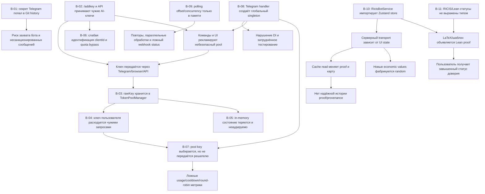

# Граф зависимостей Telegram/token-pool багов

**Дата:** 2026-08-18
**Назначение:** порядок исправления определяется причинной зависимостью, а не порядком файлов в commit.

## Слои исправления

| Слой | Корневые узлы | Правило завершения |
|---|---|---|
| L0. Внешний секрет | B-01 | token отозван владельцем; в коде нет fallback-token; секрет только в environment/secret store |
| L1. Запрет чужих ключей | B-02…B-07 | нет API/UI/Telegram входа для user API key; нет `rawKey` в доменных типах, памяти, логах и ответах |
| L2. Transport и quota | B-08…B-09 | handler получает зависимости через конструктор; transport mode отражает факт; polling имеет один управляемый цикл и await/backoff |
| L3. Application/DDD | B-10 и производные | Telegram service зависит от repository/application ports, а не Zustand; cache read не пишет; economic data не случайны |
| L4. Доверие доказательств | B-11 | RICIS reduction, Core result, Lean verified и hypothesis представлены раздельными статусами |

## Последовательность

Сначала L0 и L1. Пока система принимает или хранит чужие секреты, исправления в polling, статистике и UI не снижают главный риск. Далее исправляются L2 и L3, после чего вводятся типизированные статусы L4. После каждого слоя требуется lint, unit tests, build и повторная проверка отсутствия секретных/unsafe pattern-маркеров.
