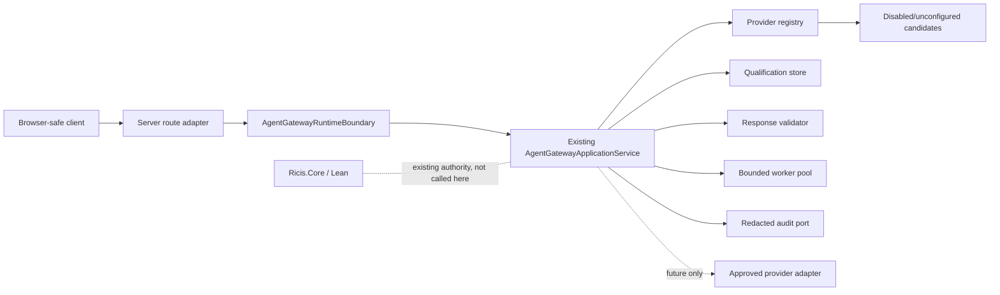

# Agent Gateway Runtime Activation — Step 2: Architecture

**Status:** `DRAFT — architecture-only; no runtime implementation or provider activation.`

**Scope identifier:** `P1-AGENT-GATEWAY-RUNTIME-ACTIVATION-01`.

**Input:** [Step 1 business specification](../02-sprints/SPRINT_AGENT_GATEWAY_RUNTIME_ACTIVATION_STEP1_BUSINESS_SPEC.md).

## 1. Architectural decision

The runtime increment introduces a narrow server composition boundary around the existing provider-neutral Agent Gateway application. The composition root creates the registry, qualification store, deterministic validator, bounded provider worker pool and redacted audit sink through dependency injection. A route adapter translates bounded HTTP input into the existing application request and translates the closed application result into browser-safe DTOs.

No concrete external provider is composed by default. The default composition contains disabled/unconfigured provider descriptors and returns a typed unavailable result. This makes the runtime testable and deployable without credentials while preserving a future injection point for reviewed adapters.



## 2. Dependency rules

| Component | Allowed dependency | Forbidden dependency |
|---|---|---|
| `AgentGatewayRuntimeBoundary` | Existing gateway application contract, request limits, DTO mapper, audit port | Provider SDK, direct `fetch`, browser globals, `process.env`, map mutation, Core/Lean execution |
| HTTP route adapter | Boundary request/response DTOs and framework request/response types | Provider registry access, raw prompt, raw Lean source, secret values, fallback network call |
| Composition root | Concrete in-memory policy implementations and injected ports | Browser storage, global mutable provider singleton, implicit default provider, secret logging |
| Provider adapter port | Existing common provider interface and bounded transport policy | UI, map store, trust promotion, arbitrary URL, client credential |
| Browser DTO | Closed availability/result fields and redacted provenance | Raw provider JSON, credentials, prompt, Lean bytes, proof/state mutation command |
| Audit sink | Redacted identifiers, hashes and typed outcomes | Prompt, node content, raw response, token, key, private source material |

The application-facing provider contract remains the single common interface. Provider-specific implementations, if added later, must derive from the shared base lifecycle and enter only through the registry. The runtime boundary never performs a concrete adapter cast.

## 3. Boundary contracts

The following contracts are the architecture target for Step 3 and Step 4. They are intentionally provider-neutral.

```ts
export interface AgentGatewayRuntimeRequest {
  readonly nodeId: string;
  readonly templateId: string;
  readonly responseSchemaId: string;
  readonly locale: string;
  readonly correlationId: string;
  readonly explicitUserRequest: true;
}

export type AgentGatewayRuntimeResult =
  | { readonly kind: 'static_host_unavailable' }
  | { readonly kind: 'unconfigured' }
  | { readonly kind: 'provider_unavailable'; readonly redactedReason: string }
  | { readonly kind: 'invalid_provider_output'; readonly redactedReason: string }
  | {
      readonly kind: 'external_ai_suggestion';
      readonly answerBasis: 'context_only' | 'context_and_web';
      readonly canonicalAnswerJson: string;
      readonly provenance: Readonly<{ providerId: string; modelId: string; adapterVersion: string }>;
    };

export interface AgentGatewayRuntimeBoundary {
  explain(request: AgentGatewayRuntimeRequest): Promise<AgentGatewayRuntimeResult>;
}

export interface RedactedAgentAuditSink {
  record(event: Readonly<{
    correlationId: string;
    nodeIdHash: string;
    templateId: string;
    responseSchemaId: string;
    outcome: AgentGatewayRuntimeResult['kind'];
  }>): void;
}
```

The concrete implementation may use branded internal IDs from the existing domain. The route adapter must parse and bound raw strings before creating branded values. The client-facing `canonicalAnswerJson` is permitted only for a validated external suggestion and must be schema-controlled; it is never interpreted as proof or state.

## 4. Composition and lifecycle

The composition root follows this sequence:

1. Construct the finite policy and reusable bounded worker pool.
2. Construct the disabled/unconfigured provider registry.
3. Construct the deterministic response validator and in-memory qualification store.
4. Construct the existing Agent Gateway application service with injected dependencies.
5. Construct the redacted audit sink.
6. Construct the runtime boundary and route adapter.
7. Register the route only when a server runtime exists; static client builds do not import or bundle the route module.

Each request is explicit and bounded. The boundary validates input, resolves the selected node and approved resource IDs through the application contract, checks static-host/runtime availability, executes through the existing pool and records one redacted terminal audit event. No scheduler, interval, retry loop outside the existing finite policy or background provider activity is permitted.

## 5. HTTP mapping

The route is a server-only BFF seam. The exact framework path is an implementation detail, but the contract must use a single POST operation with JSON input and JSON output. The request body must not accept `prompt`, `providerId`, `modelId`, `endpoint`, `apiKey`, `token`, `proof`, `state`, `type`, `formula`, `leanSource` or arbitrary tool declarations.

| Condition | HTTP mapping | Body kind |
|---|---:|---|
| Valid unavailable static host | 200 | `static_host_unavailable` |
| Valid unconfigured/disabled provider | 200 | `unconfigured` |
| Bounded provider failure | 200 | `provider_unavailable` |
| Deterministic output rejection | 422 | `invalid_provider_output` |
| Invalid request shape or size | 400 | redacted request error, not an application result |
| Unexpected server fault | 500 | generic redacted server error |

No HTTP response may contain a stack trace, provider response body, authorization header, environment value, raw Lean fragment or graph mutation command. CORS and authentication are deployment concerns for a later activation gate; their absence must not be treated as authorization.

## 6. Static-host behavior

GitHub Pages serves only the client artifact. The browser-safe client must detect an absent BFF route and map it to `static_host_unavailable`; it must not call a provider endpoint, read a provider key, emulate a server response in IndexedDB or silently invoke the legacy Gemini path. The existing static map remains fully functional when this route is absent.

## 7. Audit and data minimization

The audit port is synchronous and in-memory in this increment. It records a correlation identifier, a one-way node identifier hash, approved resource identifiers and the closed outcome kind. It does not store request prose, selected-node content, Lean fragments, response JSON, credentials, endpoint URLs or provider exception details.

One request has one terminal audit event. Cancellation, deadline, unavailable and validation failure paths must all release worker-pool capacity and record a redacted terminal outcome exactly once. An audit sink failure must not cause a provider retry or mutate the map; the route returns a redacted internal error only if the application contract cannot complete safely.

## 8. Containment and test seams

The runtime boundary is tested with injected fakes for the application service, audit sink and transport-free disabled registry. A topology test scans the new runtime module for forbidden imports and sensitive strings. The test suite must prove that the new route is not imported by the browser entry module and that the existing `server.ts` Gemini path remains unchanged.

The architecture deliberately does not prescribe a real provider adapter. A later adapter scope must add its own official endpoint/auth research, secret configuration port, consent/entitlement checks, fixed endpoint transport, structured-output mapping, provider-specific error normalization and adapter integration tests. It must not bypass this boundary or call from React.

## 9. RICIS and proof authority

The runtime boundary transports only external-agent suggestion or typed unavailability. It has no command capable of modifying nodes, edges, type, state, formula, trust, proof, Lean artifact or Core result. `LEAN_VERIFIED` and authoritative RICIS outcomes remain exclusively produced by the existing approved Core/Lean path.

A provider response that states `0/0 = 0`, claims proof, or attempts to rewrite RICIS semantics is untrusted data and must be rejected or displayed only as a non-authoritative invalid/provider result according to the existing validator. The runtime never promotes or repairs such content.

## 10. Architecture acceptance criteria

The Step 2 artifact is complete when the red baseline can target these observable properties: one common runtime boundary; DI-only composition; static-host and unconfigured fail-closed outcomes; bounded request parsing; redacted audit; no browser import; no provider key/network in client code; preserved legacy Gemini path; no graph/proof mutation; and exactly-once terminal handling across pool lifecycle outcomes.

## References

[1]: `docs/02-sprints/SPRINT_AGENT_GATEWAY_STEP1_BUSINESS_SPEC.md` — approved provider-neutral gateway scope.

[2]: `docs/03-quality/SPRINT_AGENT_GATEWAY_STEP4_RELEASE_EVIDENCE.md` — current deterministic implementation and deferred activation boundary.

[3]: `docs/01-architecture/SPRINT_AGENT_GATEWAY_STEP2_ARCHITECTURE.md` — existing common interfaces, provider registry and trust boundaries.
