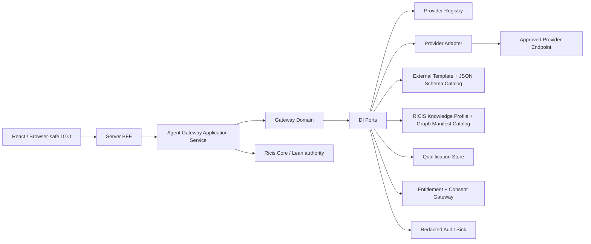

# AI Agent Gateway — Шаг 2: architecture contracts

**Статус:** `APPROVED — пользователь подтвердил переход к Шагу 3: QA specification. Runtime implementation, provider calls, secret provisioning, UI, persistence adapters and changes to Ricis.Core remain out of scope until the following gates are approved.`

**Вход:** утверждённая [Step 1 business specification](../02-sprints/SPRINT_AGENT_GATEWAY_STEP1_BUSINESS_SPEC.md).
**Зависимости:** [Strict Development Rules](../06-canonical-template/STRICT_DEVELOPMENT_RULES.md), [Host Control Step 2 architecture patterns](./SPRINT_HOST_CONTROL_PLANE_STEP2_ARCHITECTURE.md), [provider research record](./AGENT_GATEWAY_PROVIDER_RESEARCH_SOURCES.md), existing `server.ts` and `src/model/modelPool.types.ts`.

> **Ключевое решение:** Gateway квалифицирует конкретную конфигурацию `provider + model + adapter + manifest/schema/profile revision` и может использовать её как alternative RICIS engine path. Но только approved Ricis.Core/Lean execution path сохраняет или производит final mathematical/proof status. Provider output, even when qualified, is never evidence that TypeScript may mark `LEAN_VERIFIED`.

## 1. Bounded contexts и dependency direction



| Layer | May depend on | May not depend on |
|---|---|---|
| React/UI | Browser-safe DTOs, typed availability and redacted provenance. | API key, credential, raw Lean export beyond permitted view, provider raw error, graph manifest mutation, proof-status promotion. |
| BFF/application | Domain commands/results and injected ports. | Browser storage, global singleton, direct provider SDK, `process.env`, arbitrary `fetch`, `localStorage` model default. |
| Domain | Branded value objects, immutable unions, policies and ports. | Express, React, provider SDKs, credential strings, Node globals, database client, `RicisWasmBridge` implementation. |
| Provider adapter | `IAgentProvider` port and its own approved SDK/HTTP runtime dependency. | UI, entitlement decision, graph/profile mutation, trust promotion, raw credential exposure. |
| Ricis.Core / Lean | Canonical computation and final verification. | Provider selection, prompt/template rendering, external agent result as a replacement calculation. |

`AgentGateway` is a separate bounded context. It may assemble a permitted research request, compare structured output to a RICIS profile and retain provenance. It cannot evaluate a proof, write Lean, compile Lean, resolve a graph node or alter RICIS trust taxonomy.

## 2. Existing integration seams and non-breaking migration

Current `server.ts` defines a Gemini-specific `MODELS_POOL` and `callAIWithFallback(prompt, mimeType, preferredModel)`. `src/model/modelPool.types.ts` separately defines `IAiModelOption` and `AVAILABLE_GEMINI_MODELS`; `apiClient.ts` also uses the `ricis_selected_ai_model` browser preference. These are existing public/consumed members and **must not be deleted or silently renamed** in this sprint.

| Existing seam | Step 2 target seam | Migration rule for later implementation |
|---|---|---|
| `MODELS_POOL` | `GeminiProviderDescriptor` projected through `IAgentProviderRegistry`. | Gemini list moves only after a compatibility projection exists and direct regression tests protect current options. |
| `callAIWithFallback` | `IAgentInvocationGateway.invoke()` plus provider-specific retry policy. | No TypeScript fallback becomes mathematics; current fallback behaviour is extracted, not broadened. |
| `IAiModelOption` | `AgentModelOptionDto` projection. | Existing fields `id`, `name`, `category`, `isDefault`, `isFast` remain intact. |
| Client `preferredModel` | `AgentModelSelectionRequest`. | Browser preference remains a non-authoritative hint; server validates allowed provider/model/feature combination. |
| Current JSON regex extraction | `IStructuredJsonParser` + `IAgentResponseValidator`. | No regex stripping is accepted for new gateway responses; malformed/duplicate-key/non-schema JSON is typed rejection. |

## 3. Shared value objects and safe enumerations

All IDs and hashes are opaque branded values. A future factory/validator owns parsing and limits; no port accepts raw unbounded strings as an authoritative identifier.

```ts
export type Brand<Value, Name extends string> = Value & {
  readonly __brand: Name;
};

export type AgentProviderId = Brand<string, 'AgentProviderId'>;
export type AgentModelId = Brand<string, 'AgentModelId'>;
export type AgentAdapterVersion = Brand<string, 'AgentAdapterVersion'>;
export type AgentProviderFingerprint = Brand<string, 'AgentProviderFingerprint'>;
export type AgentRequestId = Brand<string, 'AgentRequestId'>;
export type AgentTemplateId = Brand<string, 'AgentTemplateId'>;
export type AgentTemplateVersion = Brand<string, 'AgentTemplateVersion'>;
export type AgentResponseSchemaId = Brand<string, 'AgentResponseSchemaId'>;
export type AgentResponseSchemaVersion = Brand<string, 'AgentResponseSchemaVersion'>;
export type RicisKnowledgeProfileId = Brand<string, 'RicisKnowledgeProfileId'>;
export type RicisKnowledgeProfileVersion = Brand<string, 'RicisKnowledgeProfileVersion'>;
export type RicisGraphId = Brand<string, 'RicisGraphId'>;
export type RicisGraphVersion = Brand<string, 'RicisGraphVersion'>;
export type ManifestHash = Brand<string, 'ManifestHash'>;
export type CanonicalJsonHash = Brand<string, 'CanonicalJsonHash'>;
export type HttpsSourceUrl = Brand<string, 'HttpsSourceUrl'>;
export type LeanArtifactId = Brand<string, 'LeanArtifactId'>;
export type LeanFragmentId = Brand<string, 'LeanFragmentId'>;
export type CorrelationId = Brand<string, 'CorrelationId'>;
export type AuditEventId = Brand<string, 'AuditEventId'>;
export type UnixEpochSeconds = Brand<number, 'UnixEpochSeconds'>;
```

```ts
export type AgentCapability =
  | 'text_completion'
  | 'structured_json'
  | 'model_catalog'
  | 'web_search_with_citations'
  | 'tool_usage_observability'
  | 'provider_fingerprint';

export type AgentToolSelectionPolicy =
  | { readonly kind: 'none' }
  | {
      readonly kind: 'auto';
      readonly maxToolCalls: number;
      readonly maxCitations: number;
      readonly maxElapsedMilliseconds: number;
      readonly maxProviderCostMinorUnits: number;
    };

export type AgentAnswerBasis = 'context_only' | 'context_and_web';

export type AgentResponseKind =
  | 'answer'
  | 'insufficient_context'
  | 'tool_unavailable'
  | 'quota_unavailable'
  | 'refusal';

export type AgentProviderAvailability =
  | { readonly kind: 'ready'; readonly capabilities: readonly AgentCapability[] }
  | { readonly kind: 'unconfigured' }
  | { readonly kind: 'disabled' }
  | { readonly kind: 'quota_exhausted' }
  | { readonly kind: 'rate_limited'; readonly retryAfterSeconds?: number }
  | { readonly kind: 'payment_required' }
  | { readonly kind: 'tool_unavailable'; readonly capability: AgentCapability }
  | { readonly kind: 'provider_unavailable'; readonly redactedReason: string }
  | { readonly kind: 'static_host_unavailable' }
  | { readonly kind: 'requires_reauthentication' };
```

`AgentCapability`, response kind and availability are closed unions. A provider cannot add a capability or state by returning an arbitrary string.

## 4. Provider descriptor, model catalog and adapter ports

A descriptor is reviewed static metadata. Availability is a separate run-time observation. Credential values remain adapter-private and never occur in a domain DTO.

```ts
export interface AgentProviderDescriptor {
  readonly providerId: AgentProviderId;
  readonly displayResourceKey: string;
  readonly adapterVersion: AgentAdapterVersion;
  readonly endpointFamily: 'gemini_developer_api' | 'openai_compatible' | 'huggingface_router' | 'cloudflare_workers_ai';
  readonly serverRuntimeRequired: true;
  readonly supportedCapabilities: readonly AgentCapability[];
  readonly requiresExternalProcessingConsent: boolean;
  readonly maximumRequestBytes: number;
  readonly maximumResponseBytes: number;
  readonly defaultEnabled: false;
}

export interface AgentModelDescriptor {
  readonly providerId: AgentProviderId;
  readonly modelId: AgentModelId;
  readonly displayResourceKey: string;
  readonly capabilities: readonly AgentCapability[];
  readonly category: 'flash' | 'pro' | 'experimental' | 'other';
  readonly isFast: boolean;
  readonly isDefaultCandidate: boolean;
}

export interface AgentModelOptionDto {
  readonly id: string;
  readonly name: string;
  readonly category: 'flash' | 'pro' | 'experimental' | 'other';
  readonly isDefault?: boolean;
  readonly isFast?: boolean;
  readonly providerId: AgentProviderId;
  readonly modelId: AgentModelId;
  readonly availability: AgentProviderAvailability['kind'];
  readonly capabilities: readonly AgentCapability[];
}

export interface AgentCitation {
  readonly url: HttpsSourceUrl;
  readonly title: string;
  readonly excerptHash: CanonicalJsonHash;
  readonly citationIndex: number;
}

export interface ObservedToolEvent {
  readonly tool: 'web_search_with_citations';
  readonly invocationIndex: number;
  readonly citations: readonly AgentCitation[];
}

export interface ProviderStructuredResponse {
  readonly requestId: AgentRequestId;
  readonly providerId: AgentProviderId;
  readonly modelId: AgentModelId;
  readonly providerFingerprint?: AgentProviderFingerprint;
  readonly rawJson: string;
  readonly observedToolEvents: readonly ObservedToolEvent[];
  readonly receivedAt: UnixEpochSeconds;
}

export interface IAgentProvider {
  descriptor(): AgentProviderDescriptor;
  listModels(): Promise<readonly AgentModelDescriptor[]>;
  checkAvailability(): Promise<AgentProviderAvailability>;
  completeStructured(input: ProviderStructuredRequest): Promise<ProviderStructuredResponse | ProviderInvocationFailure>;
}

export interface ProviderStructuredRequest {
  readonly requestId: AgentRequestId;
  readonly modelId: AgentModelId;
  readonly renderedInstruction: string;
  readonly responseSchema: AgentResponseSchema;
  readonly toolPolicy: AgentToolSelectionPolicy;
  readonly maxInputBytes: number;
  readonly maxOutputBytes: number;
  readonly correlationId: CorrelationId;
}

export type ProviderInvocationFailure =
  | { readonly kind: 'quota_exhausted' }
  | { readonly kind: 'rate_limited'; readonly retryAfterSeconds?: number }
  | { readonly kind: 'payment_required' }
  | { readonly kind: 'tool_unavailable'; readonly capability: AgentCapability }
  | { readonly kind: 'provider_unavailable'; readonly redactedReason: string }
  | { readonly kind: 'response_too_large' }
  | { readonly kind: 'timeout' };

export interface IAgentProviderRegistry {
  findProvider(providerId: AgentProviderId): IAgentProvider | null;
  listDescriptors(): readonly AgentProviderDescriptor[];
}
```

`completeStructured` is an adapter boundary, not a generic outbound fetch abstraction. The adapter calls only its reviewed endpoint family and only after the application layer passed authorization, consent, availability, qualification and bounded request policy.

## 5. External templates, Lean context and structured JSON validation

All question prose, report prose and schemas reside in external versioned resources. The domain receives a resolved instruction only after the template catalog has bound a safe parameter object. The response parser is deterministic and must reject duplicate keys, invalid UTF-8/JSON, unknown required contract version, excessive depth/bytes/items and schema mismatch.

```ts
export interface LeanContextEnvelope {
  readonly artifactId: LeanArtifactId;
  readonly artifactHash: ManifestHash;
  readonly locale: string;
  readonly classification: 'exportable_research_context';
  readonly sourceTrustStatus:
    | 'LEAN_VERIFIED'
    | 'TRUSTED_AXIOM'
    | 'REQUIRES_CORE_LEAN'
    | 'STATIC_CHECK_PASSED'
    | 'HYPOTHESIS'
    | 'REJECTED';
  readonly fragments: readonly LeanContextFragment[];
}

export interface LeanContextFragment {
  readonly fragmentId: LeanFragmentId;
  readonly contentHash: CanonicalJsonHash;
  readonly text: string;
}

export interface AgentQuestionTemplate {
  readonly templateId: AgentTemplateId;
  readonly version: AgentTemplateVersion;
  readonly locale: string;
  readonly instructionResourceKey: string;
  readonly parameterSchema: AgentResponseSchema;
  readonly responseSchemaId: AgentResponseSchemaId;
  readonly responseSchemaVersion: AgentResponseSchemaVersion;
  readonly toolPolicy: AgentToolSelectionPolicy;
  readonly qualificationSequence: 'control_before_primary' | 'control_after_quarantined_primary';
}

export interface AgentResponseSchema {
  readonly schemaId: AgentResponseSchemaId;
  readonly version: AgentResponseSchemaVersion;
  readonly canonicalSchemaJson: string;
  readonly canonicalSchemaHash: CanonicalJsonHash;
  readonly maximumJsonBytes: number;
  readonly maximumDepth: number;
  readonly maximumArrayItems: number;
}

export interface ResolvedAgentQuestion {
  readonly template: AgentQuestionTemplate;
  readonly renderedInstruction: string;
  readonly leanContext: LeanContextEnvelope;
}

export interface IAgentTemplateCatalog {
  resolveQuestion(
    templateId: AgentTemplateId,
    locale: string,
    parameters: Readonly<Record<string, unknown>>,
  ): Promise<ResolvedAgentQuestion | AgentTemplateResolutionFailure>;
  findResponseSchema(
    schemaId: AgentResponseSchemaId,
    version: AgentResponseSchemaVersion,
  ): Promise<AgentResponseSchema | null>;
}

export type AgentTemplateResolutionFailure =
  | { readonly kind: 'template_not_found' }
  | { readonly kind: 'locale_not_supported' }
  | { readonly kind: 'parameter_schema_rejected' }
  | { readonly kind: 'response_schema_not_found' };

export interface ValidatedAgentAnswer {
  readonly schemaId: AgentResponseSchemaId;
  readonly schemaVersion: AgentResponseSchemaVersion;
  readonly responseKind: AgentResponseKind;
  readonly answerBasis: AgentAnswerBasis;
  readonly canonicalJson: string;
  readonly canonicalJsonHash: CanonicalJsonHash;
  readonly referencedLeanFragments: readonly LeanFragmentId[];
  readonly webEvidence: readonly AgentCitation[];
}

export type AgentResponseValidationResult =
  | { readonly kind: 'valid'; readonly answer: ValidatedAgentAnswer }
  | { readonly kind: 'invalid_provider_output'; readonly redactedReason: string };

export interface IAgentResponseValidator {
  validate(
    response: ProviderStructuredResponse,
    schema: AgentResponseSchema,
    input: LeanContextEnvelope,
    policy: AgentToolSelectionPolicy,
  ): Promise<AgentResponseValidationResult>;
}
```

`IAgentResponseValidator` verifies observed provider tool events, not merely JSON self-report. A `context_only` result must contain no web evidence/tool event. A `context_and_web` result must contain at least one validated HTTPS citation and matching observed `web_search_with_citations` event. No new gateway contract returns free-form fallback text.

## 6. Application command and typed invocation result

The application command is not a raw prompt endpoint. It identifies reviewed resources and bound model/provider choice. Browser-provided provider/model hints are validated server-side and never select an endpoint directly.

```ts
export interface AgentModelSelectionRequest {
  readonly providerId: AgentProviderId;
  readonly modelId: AgentModelId;
}

export interface InvokeAgentQuestion {
  readonly requestId: AgentRequestId;
  readonly accountId: string;
  readonly selection: AgentModelSelectionRequest;
  readonly templateId: AgentTemplateId;
  readonly locale: string;
  readonly templateParameters: Readonly<Record<string, unknown>>;
  readonly leanContext: LeanContextEnvelope;
  readonly correlationId: CorrelationId;
}

export type AgentInvocationResult =
  | {
      readonly kind: 'accepted';
      readonly answer: ValidatedAgentAnswer;
      readonly provenance: AgentExecutionProvenance;
    }
  | { readonly kind: 'qualification_required' }
  | { readonly kind: 'qualification_failed'; readonly redactedReason: string }
  | { readonly kind: 'knowledge_conflict'; readonly redactedReason: string }
  | { readonly kind: 'invalid_provider_output'; readonly redactedReason: string }
  | { readonly kind: 'external_processing_consent_required' }
  | { readonly kind: 'artifact_access_denied' }
  | { readonly kind: 'feature_entitlement_required' }
  | { readonly kind: 'provider_unavailable'; readonly availability: AgentProviderAvailability }
  | { readonly kind: 'static_host_unavailable' }
  | { readonly kind: 'template_resolution_failed'; readonly failure: AgentTemplateResolutionFailure };

export interface AgentExecutionProvenance {
  readonly requestId: AgentRequestId;
  readonly providerId: AgentProviderId;
  readonly modelId: AgentModelId;
  readonly adapterVersion: AgentAdapterVersion;
  readonly providerFingerprint?: AgentProviderFingerprint;
  readonly templateId: AgentTemplateId;
  readonly templateVersion: AgentTemplateVersion;
  readonly responseSchemaHash: CanonicalJsonHash;
  readonly leanArtifactId: LeanArtifactId;
  readonly leanArtifactHash: ManifestHash;
  readonly qualificationKey: ProviderQualificationKey;
  readonly engineClassification: EngineClassification;
  readonly correlationId: CorrelationId;
}

export interface IAgentInvocationGateway {
  invoke(input: InvokeAgentQuestion): Promise<AgentInvocationResult>;
}
```

`accepted` means the external response passed this gateway’s schema, policy, consent, qualification and provenance gates. It never means proof resolved, Lean compiled, truth proved or an agent became an authority.

## 7. RICIS Knowledge Profile and axiom-control contracts

A `RicisKnowledgeProfile` is application-owned, externally versioned knowledge. It is not model memory and it is not written by an agent. The first profile represents the required typed-zero same-generator control: expected semantic value `1` under the RICIS SP3/A4 profile, with the exact existing source trust status preserved.

```ts
export interface RicisKnowledgeProfile {
  readonly profileId: RicisKnowledgeProfileId;
  readonly version: RicisKnowledgeProfileVersion;
  readonly profileHash: ManifestHash;
  readonly sourceTrustStatus:
    | 'LEAN_VERIFIED'
    | 'TRUSTED_AXIOM'
    | 'REQUIRES_CORE_LEAN'
    | 'STATIC_CHECK_PASSED'
    | 'HYPOTHESIS'
    | 'REJECTED';
  readonly axiomIds: readonly string[];
  readonly expectedOutcome: ExpectedControlOutcome;
}

export interface ExpectedControlOutcome {
  readonly responseKind: 'answer';
  readonly semanticValueCanonicalJson: string;
  readonly requiredAxiomIds: readonly string[];
  readonly requiredAnswerBasis: 'context_only';
  readonly expectedToolCalls: 0;
}

export interface AxiomControlTemplate {
  readonly templateId: AgentTemplateId;
  readonly version: AgentTemplateVersion;
  readonly knowledgeProfileId: RicisKnowledgeProfileId;
  readonly knowledgeProfileVersion: RicisKnowledgeProfileVersion;
  readonly responseSchemaId: AgentResponseSchemaId;
  readonly responseSchemaVersion: AgentResponseSchemaVersion;
  readonly toolPolicy: { readonly kind: 'none' };
}

export type AxiomControlOutcome =
  | { readonly kind: 'pass'; readonly profileId: RicisKnowledgeProfileId }
  | { readonly kind: 'knowledge_conflict'; readonly redactedReason: string }
  | { readonly kind: 'invalid_provider_output'; readonly redactedReason: string }
  | { readonly kind: 'control_unavailable'; readonly availability: AgentProviderAvailability };

export interface IKnowledgeProfileCatalog {
  findProfile(
    profileId: RicisKnowledgeProfileId,
    version: RicisKnowledgeProfileVersion,
  ): Promise<RicisKnowledgeProfile | null>;
  findControlTemplate(
    profile: RicisKnowledgeProfile,
    locale: string,
  ): Promise<AxiomControlTemplate | null>;
}

export interface IAxiomControlEvaluator {
  evaluate(
    profile: RicisKnowledgeProfile,
    template: AxiomControlTemplate,
    response: ProviderStructuredResponse,
    validation: AgentResponseValidationResult,
  ): Promise<AxiomControlOutcome>;
}
```

A control template always has `toolPolicy.none`; it can neither search, receive a full Lean bundle nor serve as an invisible retraining loop. Its compact JSON answer checks one declared profile only. A `pass` is an agent-quality signal; it cannot alter the profile, graph, source trust status or `RicisWasmBridge.evaluate()`.

## 8. Provider qualification and alternative-engine graph contracts

Qualification is keyed by the exact configuration. This prevents a pass for one provider/model/adapter/schema/profile policy from silently transferring to another configuration.

```ts
export interface ProviderQualificationKey {
  readonly providerId: AgentProviderId;
  readonly modelId: AgentModelId;
  readonly adapterVersion: AgentAdapterVersion;
  readonly providerFingerprint?: AgentProviderFingerprint;
  readonly responseSchemaSetHash: ManifestHash;
  readonly knowledgeProfileSetHash: ManifestHash;
  readonly toolPolicyHash: ManifestHash;
  readonly graphManifestHash?: ManifestHash;
}

export type ProviderQualificationState =
  | 'unqualified'
  | 'qualifying'
  | 'qualified'
  | 'qualification_failed'
  | 'stale'
  | 'revoked';

export interface ProviderQualificationRecord {
  readonly qualificationKey: ProviderQualificationKey;
  readonly state: ProviderQualificationState;
  readonly requiredProfiles: readonly RicisKnowledgeProfileId[];
  readonly completedAt?: UnixEpochSeconds;
  readonly invalidatedAt?: UnixEpochSeconds;
  readonly redactedReason?: string;
}

export interface IProviderQualificationStore {
  find(key: ProviderQualificationKey): Promise<ProviderQualificationRecord | null>;
  save(record: ProviderQualificationRecord): Promise<void>;
  invalidate(key: ProviderQualificationKey, at: UnixEpochSeconds, reason: string): Promise<void>;
}

export type EngineClassification =
  | 'external_agent'
  | 'ricis_engine_candidate'
  | 'ricis_compatible_engine'
  | 'authoritative_ricis_core';

export interface RicisGraphManifest {
  readonly graphId: RicisGraphId;
  readonly graphVersion: RicisGraphVersion;
  readonly manifestHash: ManifestHash;
  readonly nodeHashes: readonly CanonicalJsonHash[];
  readonly edgeHashes: readonly CanonicalJsonHash[];
  readonly requiredKnowledgeProfiles: readonly RicisKnowledgeProfileId[];
  readonly requiredControlTemplateIds: readonly AgentTemplateId[];
  readonly requiredResponseSchemaHashes: readonly CanonicalJsonHash[];
  readonly compatibilitySuiteRevision: string;
}

export interface EngineCompatibilityRecord {
  readonly engineClassification: 'ricis_compatible_engine';
  readonly qualificationKey: ProviderQualificationKey;
  readonly graphManifestHash: ManifestHash;
  readonly compatibilitySuiteRevision: string;
  readonly qualifiedAt: UnixEpochSeconds;
}

export type EngineClassificationResult =
  | { readonly kind: 'external_agent'; readonly classification: 'external_agent' }
  | { readonly kind: 'candidate_manifest_rejected'; readonly redactedReason: string }
  | { readonly kind: 'ricis_engine_candidate'; readonly manifest: RicisGraphManifest }
  | { readonly kind: 'ricis_compatible_engine'; readonly record: EngineCompatibilityRecord };

export interface IEngineCompatibilityRegistry {
  classify(
    key: ProviderQualificationKey,
    claimedManifest: RicisGraphManifest | null,
  ): Promise<EngineClassificationResult>;
  findCompatible(key: ProviderQualificationKey): Promise<EngineCompatibilityRecord | null>;
}
```

`authoritative_ricis_core` is deliberately absent from `IEngineCompatibilityRegistry` result. It is reserved for direct approved Ricis.Core/Lean provenance. An external provider cannot obtain it by credential, manifest, control answer, template declaration or client-provided field.

## 9. Authorization, consent, runtime and audit ports

Authorization and consent must happen before external provider invocation. The browser has no shared server credential and static deployment cannot simulate an adapter using a browser key.

```ts
export interface AgentInvocationAuthorizationRequest {
  readonly accountId: string;
  readonly providerId: AgentProviderId;
  readonly modelId: AgentModelId;
  readonly feature: 'ricis_agent_research';
  readonly leanArtifactId: LeanArtifactId;
}

export type AgentInvocationAuthorizationResult =
  | { readonly kind: 'allowed' }
  | { readonly kind: 'feature_entitlement_required' }
  | { readonly kind: 'artifact_access_denied' }
  | { readonly kind: 'requires_authentication' };

export interface ExternalProcessingConsentRequest {
  readonly accountId: string;
  readonly providerId: AgentProviderId;
  readonly leanArtifactId: LeanArtifactId;
  readonly classification: LeanContextEnvelope['classification'];
}

export type ExternalProcessingConsentResult =
  | { readonly kind: 'granted'; readonly consentVersion: string }
  | { readonly kind: 'required' }
  | { readonly kind: 'revoked' };

export interface IAgentAuthorizationGateway {
  authorize(input: AgentInvocationAuthorizationRequest): Promise<AgentInvocationAuthorizationResult>;
  externalProcessingConsent(input: ExternalProcessingConsentRequest): Promise<ExternalProcessingConsentResult>;
}

export interface IAgentRuntimeContext {
  serverRuntimeAvailable(): boolean;
}

export interface AgentAuditEvent {
  readonly eventId: AuditEventId;
  readonly requestId: AgentRequestId;
  readonly correlationId: CorrelationId;
  readonly providerId: AgentProviderId;
  readonly modelId: AgentModelId;
  readonly eventType:
    | 'invocation_denied'
    | 'qualification_started'
    | 'qualification_passed'
    | 'qualification_failed'
    | 'provider_invoked'
    | 'structured_output_rejected'
    | 'knowledge_conflict'
    | 'answer_accepted';
  readonly outcome: 'allowed' | 'denied' | 'failed';
  readonly templateId?: AgentTemplateId;
  readonly profileHash?: ManifestHash;
  readonly graphManifestHash?: ManifestHash;
  readonly redactedReason?: string;
  readonly at: UnixEpochSeconds;
}

export interface IAgentAuditSink {
  append(event: AgentAuditEvent): Promise<void>;
}
```

Audit must not contain prompt text, raw Lean fragment text, raw provider body, key/token, OAuth material, private key, full citation excerpt or hidden provider reasoning. It retains only redacted outcome and stable hashes/identifiers.

## 10. Required application orchestration sequence

`IAgentInvocationGateway` implementation must observe these finite paths. A runtime adapter must not reorder policy guards to make a provider call before consent, authorization or bounded template resolution.

| Stage | `control_before_primary` | `control_after_quarantined_primary` |
|---|---|---|
| 1. Guard | Server runtime, descriptor/capability, artifact access, feature entitlement and consent. | Same guards. |
| 2. Qualification lookup | Exact key found `qualified` → primary. Any other state → compact control. | Exact key found `qualified` → primary. Any other state → primary response remains request-memory quarantined. |
| 3. Control | `ToolSelectionPolicy.none`, profile set, JSON validation and expected-value comparison. | Execute the same compact controls after preliminary answer; tool use is prohibited in each control. |
| 4. Outcome | On all pass → save `qualified`, invoke primary. Otherwise typed denial. | On all pass → save `qualified`, validate/release quarantined primary result. Otherwise discard it and return typed denial. |
| 5. Main result | Validate schema, observed tools, Lean references, citations and provenance. | Same validation must already have occurred before a quarantined result can be released. |

A `stale`, `revoked` or failed qualification never releases a primary result. Qualification neither schedules background probes nor stores a partial pass. A provider/model/adapter/schema/profile/policy/graph-manifest fingerprint change invalidates the prior record.

## 11. Architecture acceptance checklist before QA

1. Every provider/model/template/schema/profile/graph identifier is branded or hash-addressed; no client string can become endpoint or authority.
2. `IAgentProvider` has no generic URL/fetch contract, no credential parameter and no trust-state mutation capability.
3. Current Gemini model/public UI contracts are preserved through a compatibility projection; no existing public member is deleted in this sprint.
4. New question/report wording and JSON schemas are external versioned resources; no prompt/report prose is hard-coded in gateway implementation.
5. Structured output validation rejects malformed, duplicate-key, oversized, non-schema or tool-provenance-mismatched JSON without free-form fallback.
6. Control questions are compact `ToolSelectionPolicy.none` calls; the SP3/A4 typed-zero same-generator profile expects JSON semantic value `1` with existing source trust retained.
7. `ProviderQualificationKey` invalidates on provider/model/adapter/provider fingerprint/schema/profile/policy/graph-manifest change.
8. Only `qualified` exact keys may release a RICIS agent answer; unqualified preliminary output is request-memory quarantined and discarded on any failed control.
9. `RicisGraphManifest` is external immutable resource; provider self-description or generated graph content cannot make an engine compatible.
10. `ricis_compatible_engine` is a provenance classification only; it cannot replace `RicisWasmBridge.evaluate()`, emit `LEAN_VERIFIED`, resolve proof state or become `authoritative_ricis_core`.
11. Server authorization + consent happen before provider invocation. Static hosting returns typed unavailable state; no browser key or direct browser provider execution exists.
12. Audit DTO excludes raw Lean/prompt/provider responses, hidden reasoning, credentials and tokens.
13. Every planned public factory, parser, validator, port method and application service method receives direct regression tests in Step 3 before runtime implementation.

## 12. Direct adversarial contract-test matrix for Step 3

The following matrix is binding on Step 3. It does not implement runtime behaviour now; it ensures that every future public port/application method receives direct regression coverage before it is enabled.

| Contract method / public surface | Direct adversarial tests required |
|---|---|
| `IAgentProvider.descriptor`, `listModels`, `checkAvailability` | Immutable descriptor projection; no credentials; closed capability union; Gemini compatibility projection; disabled/unconfigured/quota/rate/static-host state mapping. |
| `IAgentProvider.completeStructured` | Only descriptor-approved endpoint family in adapter test double; bounded request/output; typed timeout/rate/payment/quota/tool failures; no generic URL input; observed tool event capture. |
| `IAgentProviderRegistry.findProvider`, `listDescriptors` | Unknown provider returns `null`; duplicate/disabled descriptors cannot silently become default; returned descriptor list is immutable. |
| `IAgentTemplateCatalog.resolveQuestion`, `findResponseSchema` | External template/schema lookup; locale fallback; invalid parameters; no raw prompt override; unknown/stale schema rejection; localized resource key only. |
| `IAgentResponseValidator.validate` | Invalid JSON, duplicate key, invalid UTF-8, max bytes/depth/items, wrong enum, unknown Lean fragment, missing HTTPS citation, forged `toolUsage`, unexpected tool, `context_only` with evidence and `context_and_web` without observed citation all reject. |
| `IKnowledgeProfileCatalog.findProfile`, `findControlTemplate` | Immutable profile hash/version; no agent-created profile; SP3/A4 same-generator control JSON requires semantic value `1`; existing profile trust is preserved. |
| `IAxiomControlEvaluator.evaluate` | Tool use during control fails; wrong value/axiom/schema/profile yields conflict; exact valid JSON is `pass`; pass cannot change source trust. |
| `IProviderQualificationStore.find`, `save`, `invalidate` | Exact qualification-key equality; every provider/model/adapter/fingerprint/schema/profile/policy/graph difference becomes `stale`; partial pass cannot become qualified. |
| `IEngineCompatibilityRegistry.classify`, `findCompatible` | Provider self-description rejected; missing/mismatched graph node/edge hash, control profile, schema or suite revision cannot classify compatible; no result path emits `authoritative_ricis_core`. |
| `IAgentAuthorizationGateway.authorize`, `externalProcessingConsent` | Entitlement/artifact access/consent denial occurs before adapter call; revoked consent and static runtime deny external processing; no UI-only authorization. |
| `IAgentInvocationGateway.invoke` | Both qualification orders; quarantine/discard preliminary output; primary release only after exact qualified key; graph compatibility provenance; no `LEAN_VERIFIED`, proof resolution or Core substitution. |
| `IAgentAuditSink.append` | Audit is append-only/redacted; reject/scrub raw Lean, prompt, provider body, tool reasoning, credential, token and private key fields. |

## 13. References

[1]: [Agent Gateway Step 1 business specification](../02-sprints/SPRINT_AGENT_GATEWAY_STEP1_BUSINESS_SPEC.md)
[2]: [Agent Gateway provider research sources](./AGENT_GATEWAY_PROVIDER_RESEARCH_SOURCES.md)
[3]: [Remote Ricis.Core Host Control Step 2 architecture contracts](./SPRINT_HOST_CONTROL_PLANE_STEP2_ARCHITECTURE.md)
[4]: [Strict Development Rules](../06-canonical-template/STRICT_DEVELOPMENT_RULES.md)
[5]: [Existing Gemini model contract](../../src/model/modelPool.types.ts)
[6]: [Existing server Gemini caller](../../server.ts)
