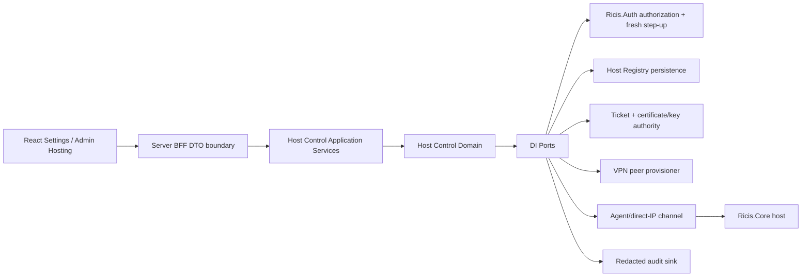

# Remote Ricis.Core Host Control Plane — Шаг 2: architecture contracts

**Статус:** `APPROVED. The contract is implemented by in-process HostControlApplicationService in v0.4.28 and covered by direct adversarial tests. Runtime networking, VPN provisioning, database schema, Express routes, UI component, cryptographic implementation and deployment remain separate unimplemented adapters.`

**Вход:** утверждённая [business/security specification](../02-sprints/SPRINT_HOST_CONTROL_PLANE_STEP1_BUSINESS_SPEC.md).
**Зависимости:** [Ricis.Auth architecture](./SPRINT_AUTH_LIBRARY_STEP2_ARCHITECTURE.md), [Strict Development Rules](../06-canonical-template/STRICT_DEVELOPMENT_RULES.md), [research sources](./ADMIN_HOST_CONTROL_PLANE_RESEARCH_SOURCES.md).

> **Ключевое решение:** OAuth access/refresh/ID token никогда не передаётся external host. Вместо него control plane выпускает короткоживущую одноразовую **signed enrollment assertion**, которая не даёт прав пользователя и пригодна только для привязки конкретного `HostId` к доказанному public-key possession.

## 1. Bounded contexts и dependency direction



| Layer | May depend on | May not depend on |
|---|---|---|
| React/UI | Safe request/response DTO, feature decision and redacted summaries. | Host private key, raw ticket after one display, OAuth token, VPN private key, arbitrary URL construction. |
| BFF/application | Domain types and ports. | Browser storage, global singleton, direct database/HTTP/VPN SDK. |
| Domain | Value objects, policies, status unions and ports. | Express, React, Node `process.env`, `fetch`, WireGuard CLI, crypto library or Core executable. |
| Infrastructure adapters | Ports plus approved runtime dependency. | Authority to alter domain policy, proof status or user entitlement. |

`HostControl` is a perimeter bounded context. It records execution provenance and access policy; it cannot create or mutate mathematical derivation, Lean evidence, author attribution, consented provider prefill, billing entitlement or client culture.

## 2. Domain vocabulary and value objects

All identifiers are opaque branded values; public API must reject unbounded strings before reaching a port implementation.

```ts
export type Brand<Value, Name extends string> = Value & { readonly __brand: Name };

export type HostId = Brand<string, 'HostId'>;
export type HostOwnerId = Brand<string, 'HostOwnerId'>;
export type OrganizationId = Brand<string, 'OrganizationId'>;
export type EnrollmentTicketId = Brand<string, 'EnrollmentTicketId'>;
export type EnrollmentNonce = Brand<string, 'EnrollmentNonce'>;
export type RouteDecisionId = Brand<string, 'RouteDecisionId'>;
export type AuditEventId = Brand<string, 'AuditEventId'>;
export type CorrelationId = Brand<string, 'CorrelationId'>;
export type IpLiteral = Brand<string, 'IpLiteral'>;
export type PortNumber = Brand<number, 'PortNumber'>;
export type HostPublicKey = Brand<string, 'HostPublicKey'>;
export type KeyFingerprint = Brand<string, 'KeyFingerprint'>;
export type CertificateFingerprint = Brand<string, 'CertificateFingerprint'>;
export type CoreBuildId = Brand<string, 'CoreBuildId'>;
export type AgentBuildId = Brand<string, 'AgentBuildId'>;
export type UnixEpochSeconds = Brand<number, 'UnixEpochSeconds'>;
```

| Value object | Invariant to enforce in future implementation |
|---|---|
| `IpLiteral` | Parsed to canonical binary IPv4/IPv6. No hostname, CIDR, URL, zone ID, username/password, query, fragment or alternate numeric syntax. |
| `PortNumber` | Integer inside approved policy range; current policy—not client—decides allowlist. |
| `HostPublicKey` | Declared algorithm and canonical encoding; no private key material. Key is accepted only after possession proof. |
| `KeyFingerprint` | Derived canonical public-key/SPKI/certificate fingerprint; not free text. |
| `EnrollmentNonce` | High entropy, one-time, HostId/audience-bound and time-bounded. |
| `RouteDecisionId` | One host, one finite operation, one expiry and policy version; never universal proxy authority. |

## 3. Modes, capabilities and lifecycle state machine

```ts
export type HostMode =
  | 'agent_tunnel'
  | 'direct_ip_webapi'
  | 'vpn_overlay'
  | 'browser_wasm';

export type HostLifecycleState =
  | 'draft'
  | 'pending_approval'
  | 'ticket_issued'
  | 'key_bound'
  | 'verifying'
  | 'active'
  | 'degraded'
  | 'suspended'
  | 'revoked'
  | 'retired'
  | 'expired';

export type RicisCoreOperation =
  | 'core.health'
  | 'expression.simplify'
  | 'expression.derivative'
  | 'expression.system'
  | 'proof.document';

export interface HostCapabilityManifest {
  readonly apiVersion: string;
  readonly coreBuildId: CoreBuildId;
  readonly agentBuildId?: AgentBuildId;
  readonly operations: readonly RicisCoreOperation[];
  readonly maxRequestBytes: number;
  readonly maxResponseBytes: number;
  readonly maxOperationSeconds: number;
  readonly manifestHash: string;
}
```

Permitted transitions are finite and policy-owned:

```text
draft → pending_approval → ticket_issued → key_bound → verifying → active
                                                   ↘ expired
active → degraded → active | suspended | revoked | retired
suspended → verifying | revoked
```

No client may submit a target state. `HostStateTransition` is an application command whose current-state, actor role, fresh-auth evidence, policy version and audit event are checked atomically by the future service.

## 4. Transport configuration contracts

The transport type controls reachability only; it never confers owner or host trust. A specific host still needs correct lifecycle state, public-key/certificate binding, capability manifest and route decision.[7]

```ts
export interface AgentTunnelTransport {
  readonly kind: 'agent_tunnel';
  readonly controlPlaneAudience: string;
  readonly requiredMutualTls: true;
}

export interface DirectIpWebApiTransport {
  readonly kind: 'direct_ip_webapi';
  readonly address: IpLiteral;
  readonly port: PortNumber;
  readonly tlsIdentity: DirectIpTlsIdentity;
  readonly requireMutualTls: true;
}

export type DirectIpTlsIdentity =
  | {
      readonly kind: 'ip_subject_alt_name';
      readonly expectedCertificateFingerprint?: CertificateFingerprint;
    }
  | {
      readonly kind: 'spki_pin';
      readonly expectedPublicKeyFingerprint: KeyFingerprint;
    };

export interface VpnOverlayTransport {
  readonly kind: 'vpn_overlay';
  readonly peerPublicKey: HostPublicKey;
  readonly assignedTunnelAddress: IpLiteral;
  readonly allowedDestination: IpLiteral;
  readonly allowedPort: PortNumber;
  readonly persistentKeepaliveSeconds?: number;
}

export interface BrowserWasmTransport {
  readonly kind: 'browser_wasm';
  readonly artifactId: string;
  readonly contentHash: string;
  readonly allowedOrigin: string;
}

export type HostTransport =
  | AgentTunnelTransport
  | DirectIpWebApiTransport
  | VpnOverlayTransport
  | BrowserWasmTransport;
```

### 4.1 Direct-IP policy boundary

`direct_ip_webapi` is first-class because an explicit public IP can be a necessary DNS-independent route. Its validation is intentionally stricter than normal browser navigation.

```ts
export type DirectIpPolicyDecision =
  | { readonly kind: 'accepted'; readonly canonicalAddress: IpLiteral; readonly policyVersion: string }
  | { readonly kind: 'forbidden_address_class'; readonly addressClass: ForbiddenAddressClass }
  | { readonly kind: 'port_not_allowed'; readonly port: PortNumber }
  | { readonly kind: 'tls_identity_required' }
  | { readonly kind: 'invalid_ip_literal' };

export type ForbiddenAddressClass =
  | 'loopback'
  | 'unspecified'
  | 'link_local'
  | 'private_network'
  | 'carrier_grade_nat'
  | 'multicast'
  | 'reserved'
  | 'cloud_metadata'
  | 'ipv4_mapped_private';
```

The policy deliberately has no `allow_any_public_url`, `allow_redirect`, `custom_path`, `custom_method` or `ignore_tls_errors` result. Direct-IP requires an IP SAN certificate or SPKI pin; an IP literal must never bypass TLS validation.[2]

### 4.2 VPN-overlay policy boundary

VPN is valid for low-volume control and bounded execution traffic, particularly when host reachability is affected by NAT, routing or domain dependency. VPN membership is **not** authorization. The future adapter configures one narrow peer identity and one narrow permitted destination, not a default route or broad subnet.

```ts
export type VpnPolicyDecision =
  | { readonly kind: 'accepted'; readonly peerFingerprint: KeyFingerprint; readonly policyVersion: string }
  | { readonly kind: 'public_key_rejected' }
  | { readonly kind: 'tunnel_address_not_allowed' }
  | { readonly kind: 'route_not_allowed' }
  | { readonly kind: 'keepalive_out_of_policy' };

export interface VpnPeerPlan {
  readonly hostId: HostId;
  readonly hostPeerPublicKey: HostPublicKey;
  readonly assignedTunnelAddress: IpLiteral;
  readonly allowedDestination: IpLiteral;
  readonly allowedPort: PortNumber;
  readonly keyFingerprint: KeyFingerprint;
  readonly expiresAt: UnixEpochSeconds;
}
```

`VpnPeerPlan` intentionally excludes a peer private key. A future VPN adapter may provision a peer after policy approval, but the user/host owns its private key. Only in `vpn_overlay` may `allowedDestination` represent a private address: it must be isolated behind the enrolled peer, reached through an assigned tunnel address and limited to one approved application port. It must never make a private network reachable through public direct-IP routing. WireGuard’s peer model binds public keys to allowed tunnel addresses; its configuration/key distribution remains an application responsibility, so the control plane must audit issuance, rotation and revocation.[5]

## 5. Enrollment protocol DTO and no-token rule

### 5.1 Distinct credentials

| Credential | Holder | Scope | Prohibited substitution |
|---|---|---|---|
| OAuth/passkey session | User + control plane. | Local user authentication and fresh step-up. | Must never be sent to host as enrollment/execution credential. |
| Signed enrollment assertion | One-time host bootstrap exchange. | One HostId, one action, one short TTL, one public-key binding. | Cannot call Core operations, manage account or survive ticket consumption. |
| Host mTLS/VPN key | Host agent/device. | Host channel and key possession. | Host private key cannot enter UI/control registry. |
| Route decision | Control plane/gateway. | One bounded operation, HostId, expiry and quota. | Cannot become universal outbound HTTP authority. |

The signed assertion may be JWS/PASETO-equivalent in a future adapter, but this architecture does not dictate a cryptographic library. It has `jti`, `aud`, `HostId`, operator/organization reference, nonce, issued/expiry time, capability policy version and public-key-binding requirement; it contains no OAuth credential, browser session secret, document body or proof claim. Control plane still performs atomic consume/replay prevention.

```ts
export interface CreateHostDraftCommand {
  readonly ownerId: HostOwnerId;
  readonly organizationId?: OrganizationId;
  readonly displayName: string;
  readonly mode: HostMode;
  readonly transport: HostTransport;
  readonly expectedCapabilities: readonly RicisCoreOperation[];
  readonly observedRequestIpHint?: IpLiteral;
}

export interface IssueEnrollmentAssertionCommand {
  readonly hostId: HostId;
  readonly actorId: HostOwnerId;
  readonly freshAuthenticationId: string;
  readonly requestedPublicKey?: HostPublicKey;
}

export interface EnrollmentAssertionForDisplay {
  readonly hostId: HostId;
  readonly opaqueAssertion: string;
  readonly expiresAt: UnixEpochSeconds;
  readonly shownOnce: true;
}

export interface HostEnrollmentPresentation {
  readonly hostId: HostId;
  readonly assertion: string;
  readonly hostPublicKey: HostPublicKey;
  readonly capabilityManifest: HostCapabilityManifest;
  readonly signedNonceResponse: string;
}

export type CompleteEnrollmentResult =
  | { readonly kind: 'host_verifying'; readonly hostId: HostId; readonly keyFingerprint: KeyFingerprint }
  | { readonly kind: 'assertion_expired' }
  | { readonly kind: 'assertion_replayed' }
  | { readonly kind: 'public_key_possession_not_proven' }
  | { readonly kind: 'capability_manifest_rejected' }
  | { readonly kind: 'transport_policy_denied'; readonly reason: string };
```

### 5.2 Safe form-rendering seam

The user’s requested “host returns a form” is represented by data, not remote HTML. A remote host may present a bounded `HostEnrollmentPresentation`; the control plane validates it and selects a local schema. The browser renders only approved control-plane fields.

```ts
export type EnrollmentFormField =
  | 'display_name'
  | 'transport_mode'
  | 'direct_ip_address'
  | 'direct_ip_port'
  | 'tls_identity'
  | 'vpn_peer_public_key'
  | 'host_public_key'
  | 'core_capability_manifest';

export interface EnrollmentFormSchema {
  readonly policyVersion: string;
  readonly fields: readonly EnrollmentFormField[];
  readonly requireFreshAuthentication: true;
  readonly requiresExplicitConfirmation: true;
}

export interface HostEndpointHint {
  readonly kind: 'observed_request_ip' | 'user_supplied';
  readonly address: IpLiteral;
  readonly editable: true;
  readonly trustedForRouting: false;
}
```

An observed browser request IP can be a visible default only. It is not a proof that it belongs to the proposed server, it may be a NAT/proxy address, and it must not auto-create a `HostTransport`.

## 6. Aggregate and persistence-facing contracts

```ts
export interface RegisteredHost {
  readonly hostId: HostId;
  readonly ownerId: HostOwnerId;
  readonly organizationId?: OrganizationId;
  readonly displayName: string;
  readonly mode: HostMode;
  readonly transport: HostTransport;
  readonly state: HostLifecycleState;
  readonly keyFingerprint?: KeyFingerprint;
  readonly capabilityManifest?: HostCapabilityManifest;
  readonly policyVersion: string;
  readonly createdAt: UnixEpochSeconds;
  readonly updatedAt: UnixEpochSeconds;
}

export interface EnrollmentAssertionRecord {
  readonly ticketId: EnrollmentTicketId;
  readonly hostId: HostId;
  readonly assertionHash: string;
  readonly nonce: EnrollmentNonce;
  readonly expiresAt: UnixEpochSeconds;
  readonly consumedAt?: UnixEpochSeconds;
  readonly revokedAt?: UnixEpochSeconds;
}

export interface HostHealthAttestation {
  readonly hostId: HostId;
  readonly keyFingerprint: KeyFingerprint;
  readonly coreBuildId: CoreBuildId;
  readonly agentBuildId?: AgentBuildId;
  readonly capabilityManifestHash: string;
  readonly nonce: EnrollmentNonce;
  readonly observedAt: UnixEpochSeconds;
  readonly signature: string;
}
```

Future persistence stores have no plain assertion, host private key, VPN private key, OAuth refresh token, raw document payload or browser session secret. The registry stores only public-key/certificate fingerprints, redacted endpoint presentation, encrypted route configuration if policy allows it and append-only audit references.

### 6.1 Complete command, result and safe UI DTO contracts

```ts
export interface HostStateTransition {
  readonly hostId: HostId;
  readonly actorId: HostOwnerId;
  readonly expectedCurrentState: HostLifecycleState;
  readonly nextState: HostLifecycleState;
  readonly freshAuthenticationId: string;
  readonly at: UnixEpochSeconds;
  readonly reason: 'approved' | 'verification_passed' | 'health_recovered' | 'policy_denied' | 'incident_suspended' | 'owner_retired';
}

export interface BindHostPublicKey {
  readonly hostId: HostId;
  readonly actorId: HostOwnerId;
  readonly publicKey: HostPublicKey;
  readonly fingerprint: KeyFingerprint;
  readonly assertionTicketId: EnrollmentTicketId;
  readonly freshAuthenticationId: string;
  readonly at: UnixEpochSeconds;
}

export interface RevokeHost {
  readonly hostId: HostId;
  readonly actorId: HostOwnerId;
  readonly freshAuthenticationId: string;
  readonly at: UnixEpochSeconds;
  readonly reason: 'owner_requested' | 'credential_compromised' | 'security_incident' | 'policy_change';
}

export interface IssueEnrollmentAssertion {
  readonly hostId: HostId;
  readonly actorId: HostOwnerId;
  readonly freshAuthenticationId: string;
  readonly publicKeyBindingRequired: true;
  readonly now: UnixEpochSeconds;
}

export interface ConsumeEnrollmentAssertion {
  readonly hostId: HostId;
  readonly opaqueAssertion: string;
  readonly presentedPublicKey: HostPublicKey;
  readonly presentedAt: UnixEpochSeconds;
}

export type PublicKeyVerificationResult =
  | { readonly kind: 'verified'; readonly fingerprint: KeyFingerprint }
  | { readonly kind: 'signature_invalid' }
  | { readonly kind: 'nonce_mismatch' }
  | { readonly kind: 'key_algorithm_not_allowed' }
  | { readonly kind: 'assertion_binding_mismatch' };

export type HealthAttestationResult =
  | { readonly kind: 'verified'; readonly hostId: HostId }
  | { readonly kind: 'host_key_mismatch' }
  | { readonly kind: 'attestation_nonce_replayed' }
  | { readonly kind: 'manifest_hash_mismatch' }
  | { readonly kind: 'timestamp_out_of_window' }
  | { readonly kind: 'signature_invalid' };

export interface VpnPeerPlanRequest {
  readonly hostId: HostId;
  readonly hostPeerPublicKey: HostPublicKey;
  readonly requestedTunnelAddress: IpLiteral;
  readonly requestedDestination: IpLiteral;
  readonly requestedPort: PortNumber;
  readonly actorId: HostOwnerId;
  readonly freshAuthenticationId: string;
}

export interface RequestRouteDecision {
  readonly hostId: HostId;
  readonly ownerId: HostOwnerId;
  readonly operation: RicisCoreOperation;
  readonly requestedAt: UnixEpochSeconds;
  readonly correlationId: CorrelationId;
}

export interface HostManagementAuthorizationRequest {
  readonly accountId: HostOwnerId;
  readonly organizationId?: OrganizationId;
  readonly action: 'create_draft' | 'issue_enrollment' | 'rotate_key' | 'suspend' | 'revoke' | 'request_route';
}

export interface FreshAuthenticationRequest {
  readonly accountId: HostOwnerId;
  readonly action: 'issue_enrollment' | 'rotate_key' | 'change_transport' | 'suspend' | 'revoke';
}

export interface HostAuditEvent {
  readonly eventId: AuditEventId;
  readonly actorId?: HostOwnerId;
  readonly hostId?: HostId;
  readonly eventType: 'draft_created' | 'assertion_issued' | 'assertion_consumed' | 'key_bound' | 'transport_denied' | 'host_active' | 'host_suspended' | 'host_revoked' | 'route_issued' | 'security_event';
  readonly outcome: 'allowed' | 'denied' | 'failed';
  readonly correlationId: CorrelationId;
  readonly policyVersion: string;
  readonly at: UnixEpochSeconds;
  readonly redactedReason?: string;
}

export interface ResolveExecutionProviderRequest {
  readonly accountId: HostOwnerId;
  readonly preferredHostId?: HostId;
  readonly operation: RicisCoreOperation;
  readonly correlationId: CorrelationId;
}

export type ExecutionProviderResult =
  | { readonly kind: 'resolved'; readonly routeDecision: BoundedRouteDecision }
  | { readonly kind: 'no_eligible_host' }
  | { readonly kind: 'preferred_host_not_allowed' }
  | { readonly kind: 'static_host_unavailable' };

export interface HostSummary {
  readonly hostId: HostId;
  readonly displayName: string;
  readonly mode: HostMode;
  readonly state: HostLifecycleState;
  readonly redactedEndpoint?: string;
  readonly operations: readonly RicisCoreOperation[];
  readonly keyFingerprintSuffix?: string;
}
```

The use of `expectedCurrentState`, `freshAuthenticationId`, correlation ID and typed denial unions makes concurrent state changes, stale UI mutations and silently broadened permissions testable. The contracts intentionally omit host credentials, network private keys, raw endpoint secrets and user OAuth material.

## 7. Dependency-inversion ports

```ts
export interface IHostRegistry {
  createDraft(host: RegisteredHost): Promise<void>;
  findById(hostId: HostId): Promise<RegisteredHost | null>;
  findOwnedBy(ownerId: HostOwnerId): Promise<readonly RegisteredHost[]>;
  transition(input: HostStateTransition): Promise<RegisteredHost>;
  bindPublicKey(input: BindHostPublicKey): Promise<RegisteredHost>;
  revoke(input: RevokeHost): Promise<void>;
}

export interface IEnrollmentAssertionIssuer {
  issue(input: IssueEnrollmentAssertion): Promise<EnrollmentAssertionForDisplay>;
  consumeOnce(input: ConsumeEnrollmentAssertion): Promise<EnrollmentAssertionRecord>;
  revokeForHost(hostId: HostId, at: UnixEpochSeconds): Promise<void>;
}

export interface IHostPublicKeyVerifier {
  verifyPossession(input: HostEnrollmentPresentation): Promise<PublicKeyVerificationResult>;
  verifyHealthAttestation(input: HostHealthAttestation): Promise<HealthAttestationResult>;
}

export interface IHostTransportPolicy {
  evaluate(input: HostTransport, actor: HostOwnerId): Promise<TransportPolicyResult>;
}

export interface IVpnPeerProvisioner {
  plan(input: VpnPeerPlanRequest): Promise<VpnPolicyDecision | VpnPeerPlan>;
  revoke(hostId: HostId, at: UnixEpochSeconds): Promise<void>;
}

export interface IHostRouteDecisionIssuer {
  issue(input: RequestRouteDecision): Promise<RouteDecisionResult>;
  invalidateHost(hostId: HostId, at: UnixEpochSeconds): Promise<void>;
}

export interface IHostAuthorizationGateway {
  hasHostManagementAccess(input: HostManagementAuthorizationRequest): Promise<HostManagementAuthorizationResult>;
  requireFreshAuthentication(input: FreshAuthenticationRequest): Promise<FreshAuthenticationResult>;
}

export interface IHostAuditSink {
  append(event: HostAuditEvent): Promise<void>;
}

export interface IExecutionProviderResolver {
  resolve(input: ResolveExecutionProviderRequest): Promise<ExecutionProviderResult>;
}
```

| Port | Sole responsibility | Explicitly excludes |
|---|---|---|
| `IHostRegistry` | Aggregate lifecycle and owner-scoped record. | Network I/O, token issuance, proof promotion. |
| `IEnrollmentAssertionIssuer` | One-use short TTL bootstrap assertion. | OAuth token forwarding, durable host API key. |
| `IHostPublicKeyVerifier` | Public-key possession and signed attestation result. | Storing host private material. |
| `IHostTransportPolicy` | Direct IP/VPN/agent/WASM policy classification. | Fetching arbitrary URL or changing route policy from client. |
| `IVpnPeerProvisioner` | Narrow peer plan/revoke decision via approved adapter. | VPN private-key export, full default-route provision. |
| `IHostRouteDecisionIssuer` | Bounded operation route issuance and invalidation. | Generic proxy/routing. |
| `IHostAuthorizationGateway` | Entitlement, tenancy and fresh-auth decision delegated to Ricis.Auth. | Provider profile retrieval, role inference by email. |
| `IHostAuditSink` | Redacted append-only audit event. | Raw ticket/token/key/document logging. |
| `IExecutionProviderResolver` | Selects an eligible Active host or typed unavailable result. | Computing proof, changing mathematical/trust status. |

### 7.1 Required typed policy results

```ts
export type HostManagementAuthorizationResult =
  | { readonly kind: 'allowed'; readonly ownerId: HostOwnerId }
  | { readonly kind: 'requires_authentication' }
  | { readonly kind: 'requires_entitlement'; readonly entitlement: 'host:manage:self' }
  | { readonly kind: 'tenant_access_denied' };

export type FreshAuthenticationResult =
  | { readonly kind: 'fresh'; readonly freshAuthenticationId: string; readonly expiresAt: UnixEpochSeconds }
  | { readonly kind: 'step_up_required'; readonly method: 'passkey' | 'external_mfa' }
  | { readonly kind: 'unavailable' };

export type TransportPolicyResult =
  | { readonly kind: 'allowed'; readonly policyVersion: string }
  | { readonly kind: 'requires_vpn_peer_plan' }
  | { readonly kind: 'direct_ip_denied'; readonly reason: ForbiddenAddressClass | 'port_not_allowed' | 'tls_identity_required' }
  | { readonly kind: 'mode_not_enabled'; readonly mode: HostMode };

export type RouteDecisionResult =
  | { readonly kind: 'issued'; readonly routeDecision: BoundedRouteDecision }
  | { readonly kind: 'host_not_active'; readonly state: HostLifecycleState }
  | { readonly kind: 'host_not_owned' }
  | { readonly kind: 'operation_not_supported'; readonly operation: RicisCoreOperation }
  | { readonly kind: 'quota_denied' }
  | { readonly kind: 'static_host_unavailable' };
```

## 8. Route decision and provenance envelope

```ts
export interface BoundedRouteDecision {
  readonly routeDecisionId: RouteDecisionId;
  readonly hostId: HostId;
  readonly operation: RicisCoreOperation;
  readonly expiresAt: UnixEpochSeconds;
  readonly maxRequestBytes: number;
  readonly maxResponseBytes: number;
  readonly maxOperationSeconds: number;
  readonly policyVersion: string;
}

export interface HostExecutionProvenance {
  readonly hostId: HostId;
  readonly routeDecisionId: RouteDecisionId;
  readonly coreBuildId: CoreBuildId;
  readonly agentBuildId?: AgentBuildId;
  readonly keyFingerprint: KeyFingerprint;
  readonly correlationId: CorrelationId;
}
```

`HostExecutionProvenance` accompanies a canonical Core response snapshot. It is not Lean evidence and cannot be used as a UI shortcut to mark `resolved`, `LEAN_VERIFIED` or trusted author metadata.[8]

## 9. BFF/UI and cross-project seams

| Boundary | Request/response direction | Contract |
|---|---|---|
| Ricis.Auth → Host Control | Server only. | `IHostAuthorizationGateway` returns local entitlement/step-up result; no raw OAuth token/claims leave Auth boundary. |
| React → BFF | Browser-safe JSON DTO only. | `HostSummary`, `HostEndpointHint`, `EnrollmentFormSchema`, typed decision/status; never ticket after initial display, key or VPN secret. |
| BFF → Host agent | Bounded enrollment/health/operation protocol. | Signed assertion, public key, nonce, mTLS/tunnel; no remote HTML, arbitrary route or user credential forwarding. |
| BFF → direct IP WebAPI | Server only. | Fixed allowlisted Core operation plus direct-IP TLS/mTLS policy. |
| BFF → VPN adapter | Server only. | `VpnPeerPlan` / revoke; no `0.0.0.0/0`, no peer private-key return. |
| Host gateway → document/proof model | Canonical snapshot only. | Host provenance preserved; trust status unchanged. |

Static deployment has no server authority and therefore `IExecutionProviderResolver` returns `static_host_unavailable`; it must not use `localStorage`, exposed environment configuration or direct browser-IP probing to imitate control-plane responsibilities.

## 10. Architecture acceptance checklist before QA

1. Contracts distinguish `agent_tunnel`, `direct_ip_webapi`, `vpn_overlay` and `browser_wasm`; WebAssembly has no IP/port registration.
2. OAuth credential and enrollment assertion are distinct in every DTO/port; no host receives a user OAuth token.
3. Direct-IP contract only accepts canonical literal IP + approved port + TLS identity, never generic URL/path/method/redirect.
4. VPN contract stores/accepts public peer key only and constrains route to one tunnel endpoint/port; no full-route peer default.
5. Public key supplied in an admin-controlled form is not accepted until possession proof/nonce verification completes.
6. UI form comes from control-plane schema, not remote HTML; observed browser IP is only a nontrusted editable hint.
7. Every sensitive command is owner/tenant/fresh-auth scoped through `IHostAuthorizationGateway`.
8. Every execution uses short-lived `BoundedRouteDecision`; no port is a generic HTTP proxy.
9. Registry/audit DTOs exclude private keys, raw tickets, OAuth token/claims and raw document body.
10. Host provenance cannot promote RICIS/Lean/formal trust state.

## References

[1]: [Host control Step 1 business/security specification](../02-sprints/SPRINT_HOST_CONTROL_PLANE_STEP1_BUSINESS_SPEC.md) — approved scope, lifecycle, threat model and P0 direct-IP/VPN requirements.
[2]: [OWASP SSRF Prevention Cheat Sheet](https://cheatsheetseries.owasp.org/cheatsheets/Server_Side_Request_Forgery_Prevention_Cheat_Sheet.html) — input constraints, blocked private targets, no redirects and egress defense.
[3]: [RFC 9700](https://www.rfc-editor.org/info/rfc9700/) — OAuth credential separation, exact redirect, PKCE/nonce/state, least privilege and sender constraint guidance.
[4]: [RFC 8705](https://datatracker.ietf.org/doc/html/rfc8705) — certificate public-key possession, mTLS authentication and certificate-bound token concepts.
[5]: [WireGuard overview](https://www.wireguard.com/) — peer public-key/allowed-IP routing and transport configuration boundary.
[6]: [WireGuard quick start](https://www.wireguard.com/quickstart/) — local private-key generation and optional NAT/firewall persistent keepalive.
[7]: [NIST SP 800-207](https://csrc.nist.gov/pubs/sp/800/207/final) — network location does not provide implicit subject/device trust.
[8]: [`MD review requirements`](../00-governance/MD_REVIEW_REQUIREMENTS_2026-08-20.md) — Core-first and Lean verification boundary.
