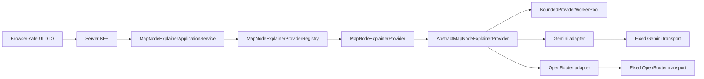

# SPRINT P1 — Read-Only Map Node Explainer: Shared Providers and Bounded Worker Pool

## Step 2: Architecture-Only Contracts

**Status:** `APPROVED` — user approval received before Step 3 QA. This file was reconstructed on the recovered isolated branch; it is architecture-only and adds no executable provider/runtime code.

**Scope identifier:** `P1-MAP-NODE-EXPLAINER-SHARED-PROVIDER-POOL-01`.

**Input:** [Approved Step 1 Business Specification](../02-sprints/SPRINT_MAP_NODE_EXPLAINER_SHARED_PROVIDER_POOL_STEP1_BUSINESS_SPEC.md).

> **Key decision:** `MapNodeExplainerProvider` is the only programming interface through which application code may interact with every provider adapter. A common abstract base class owns shared lifecycle policy. Concrete Gemini/OpenRouter adapters are transport-only implementations behind protected hooks.

## 1. Dependency direction



| Layer | Permitted dependencies | Forbidden dependencies |
|---|---|---|
| UI/BFF | Browser-safe DTOs and application service. | Concrete adapter, provider SDK, endpoint, credential, raw response/exception, storage/map mutation. |
| Application service | Registry and `MapNodeExplainerProvider` only. | Provider branches, down-casts, `instanceof`, adapter class, SDK, endpoint, secret and pool internal. |
| Registry | Common provider interface and immutable descriptor. | Provider credential/value, mutable activation, UI/store/persistence. |
| Abstract base | Common port, pool/scheduler port, clock/cancellation/validation/redaction policies. | Browser/React/Express/storage/map mutation/RICIS Core/Lean. |
| Concrete adapter | Abstract base and protected fixed transport hooks. | UI/application/store/persistence/another adapter/direct pool use. |
| Bounded pool | Provider-neutral job metadata and finite policy. | SDK types, prompt/snapshot/raw response/credential/map/UI state. |

The existing `AgentProvider`/`AgentGatewayApplicationService` contract is unchanged. A later implementation must use an additive compatibility layer or narrow extension rather than create a parallel provider registry.

## 2. Sole application-facing interface and DTOs

```ts
export type MapAssistantProviderId = string & { readonly __brand: 'MapAssistantProviderId' };
export type MapAssistantModelId = string & { readonly __brand: 'MapAssistantModelId' };
export type MapAssistantRequestId = string & { readonly __brand: 'MapAssistantRequestId' };
export type MapAssistantCorrelationId = string & { readonly __brand: 'MapAssistantCorrelationId' };
export type MapAssistantAdapterVersion = string & { readonly __brand: 'MapAssistantAdapterVersion' };
export type MapAssistantResolvedModelId = string & { readonly __brand: 'MapAssistantResolvedModelId' };

export type MapAssistantCapability =
  | 'read_only_node_explanation'
  | 'structured_explanation';

export interface MapNodeExplainerProviderDescriptor {
  readonly providerId: MapAssistantProviderId;
  readonly adapterVersion: MapAssistantAdapterVersion;
  readonly displayResourceKey: string;
  readonly configuredModelId: MapAssistantModelId;
  readonly serverRuntimeRequired: true;
  readonly defaultEnabled: false;
  readonly capabilities: readonly MapAssistantCapability[];
}

export type MapNodeExplainerAvailability =
  | { readonly kind: 'ready' }
  | { readonly kind: 'unconfigured' }
  | { readonly kind: 'disabled' }
  | { readonly kind: 'static_host_unavailable' }
  | { readonly kind: 'queue_saturated' }
  | { readonly kind: 'provider_capacity_exhausted' }
  | { readonly kind: 'quota_exhausted' }
  | { readonly kind: 'rate_limited'; readonly retryAfterSeconds?: number }
  | { readonly kind: 'payment_required' }
  | { readonly kind: 'timeout' }
  | { readonly kind: 'cancelled' }
  | { readonly kind: 'provider_unavailable'; readonly redactedReason: string }
  | { readonly kind: 'invalid_provider_output'; readonly redactedReason: string };

export interface MapNodeExplainerProvider {
  descriptor(): MapNodeExplainerProviderDescriptor;
  checkAvailability(): Promise<MapNodeExplainerAvailability>;
  explain(request: MapNodeExplanationProviderRequest): Promise<MapNodeExplainerProviderOutcome>;
}

export interface MapNodeExplainerProviderRegistry {
  find(providerId: MapAssistantProviderId): MapNodeExplainerProvider | null;
  listDescriptors(): readonly MapNodeExplainerProviderDescriptor[];
}
```

Only these common contract types cross from infrastructure toward registry, application service, BFF or UI. No layer outside a concrete adapter may import/inspect/provider-switch/down-cast vendor types. The interface does not expose generic completion, `fetch`, tool calls, credential lookup, configure/activate, mutation, proof generation, evaluator or Lean method.

```ts
export interface ReadOnlyMapNodeSnapshot {
  readonly nodeId: string;
  readonly title: string;
  readonly description: string;
  readonly targetFunction?: string;
  readonly declaredType: string;
  readonly declaredState: string;
  readonly zoneLabels: readonly string[];
  readonly dependencyIds: readonly string[];
  readonly dependentIds: readonly string[];
}

export interface MapNodeExplanationCommand {
  readonly requestId: MapAssistantRequestId;
  readonly correlationId: MapAssistantCorrelationId;
  readonly locale: string;
  readonly nodeId: string;
  readonly cancellation: MapNodeExplanationCancellation;
}

export interface MapNodeExplanationProviderRequest {
  readonly requestId: MapAssistantRequestId;
  readonly correlationId: MapAssistantCorrelationId;
  readonly locale: string;
  readonly selectedNode: ReadOnlyMapNodeSnapshot;
  readonly deadlineEpochMilliseconds: number;
  readonly cancellation: MapNodeExplanationCancellation;
}

export interface MapNodeExplanationCancellation {
  isCancellationRequested(): boolean;
  onCancellation(callback: () => void): MapNodeExplanationCancellationRegistration;
}

export interface MapNodeExplanationCancellationRegistration {
  dispose(): void;
}

export interface ReadOnlyMapNodeExplanation {
  readonly text: string;
  readonly factsUsed: readonly ('title' | 'description' | 'targetFunction' | 'declaredType' | 'declaredState' | 'zones' | 'dependencies' | 'dependents')[];
  readonly limitations: readonly string[];
  readonly classification: 'external_ai_suggestion';
  readonly proofDisclaimer: 'not_a_proof_or_state_change';
}

export interface MapNodeExplanationProvenance {
  readonly providerId: MapAssistantProviderId;
  readonly configuredModelId: MapAssistantModelId;
  readonly resolvedModelId: MapAssistantResolvedModelId;
  readonly adapterVersion: MapAssistantAdapterVersion;
  readonly requestId: MapAssistantRequestId;
  readonly correlationId: MapAssistantCorrelationId;
}

export type MapNodeExplainerProviderOutcome =
  | { readonly kind: 'explained'; readonly explanation: ReadOnlyMapNodeExplanation; readonly provenance: MapNodeExplanationProvenance }
  | { readonly kind: 'unavailable'; readonly availability: MapNodeExplainerAvailability };

export interface MapNodeExplanationRequestDto {
  readonly nodeId: string;
  readonly locale: string;
}
```

No contract contains proof text/status, `LEAN_VERIFIED`, `QED_VERIFIED`, Core/Lean call, state/type/formula update, node/edge/zone command, complete map, raw provider body, key/token or arbitrary URL.

## 3. Abstract base class and protected adapter hooks

```ts
export abstract class AbstractMapNodeExplainerProvider implements MapNodeExplainerProvider {
  public descriptor(): MapNodeExplainerProviderDescriptor {
    // Returns the immutable descriptor injected through the common base constructor.
    throw new Error('Architecture-only sketch; no Step 2 implementation.');
  }

  public abstract checkAvailability(): Promise<MapNodeExplainerAvailability>;

  public async explain(request: MapNodeExplanationProviderRequest): Promise<MapNodeExplainerProviderOutcome> {
    // Step 4 only: validate -> bounded-pool submit -> cancellation/deadline
    // -> protected transport -> normalize -> validate -> provenance.
    throw new Error('Architecture-only sketch; no Step 2 implementation.');
  }

  protected abstract executeProviderTransport(
    request: MapNodeExplanationProviderRequest,
  ): Promise<ProviderTransportReply>;

  protected abstract resolveConfiguredModelId(): MapAssistantModelId;
}

export type ProviderTransportReply =
  | {
      readonly kind: 'success';
      readonly resolvedModelId: MapAssistantResolvedModelId;
      readonly explanationText: string;
      readonly factsUsed: readonly ReadOnlyMapNodeExplanation['factsUsed'][number][];
      readonly limitations: readonly string[];
    }
  | { readonly kind: 'quota_exhausted' }
  | { readonly kind: 'rate_limited'; readonly retryAfterSeconds?: number }
  | { readonly kind: 'payment_required' }
  | { readonly kind: 'timeout' }
  | { readonly kind: 'cancelled' }
  | { readonly kind: 'provider_unavailable'; readonly redactedReason: string }
  | { readonly kind: 'invalid_provider_output'; readonly redactedReason: string };
```

The `throw` is a documentation-only placeholder and must not appear in the Step 4 public implementation. The architectural rule is that immutable `descriptor` projection and public `explain` belong to the base class. TypeScript has no `final` method; Step 3 therefore adds a topology test forbidding concrete adapters from declaring `descriptor` or `explain`, direct pool submission or independent retry/deadline logic.

| Common base owns | Concrete adapter owns |
|---|---|
| Immutable descriptor projection, snapshot/input validation, byte limits and response validation. | Mapping normalized request to one reviewed fixed provider transport. |
| Cancellation/deadline, finite queue/pool submission and exact lease lifecycle. | Parsing native reply into `ProviderTransportReply`. |
| Bounded retry/error normalization, redacted diagnostics and common outcome/provenance. | Reporting provider-resolved model identity where supported. |
| No-proof external-suggestion label and typed unavailable mapping. | No UI DTO, persistence, graph mutation, provider fallback or direct scheduler access. |

## 4. Bounded worker-pool contracts

```ts
export interface BoundedProviderWorkerPoolPolicy {
  readonly maximumActiveJobs: number;
  readonly maximumQueuedJobs: number;
  readonly maximumActiveJobsPerProvider: number;
  readonly maximumDeadlineMilliseconds: number;
  readonly maximumRetryCount: number;
}

export interface ProviderWorkerJob<T> {
  readonly providerId: MapAssistantProviderId;
  readonly requestId: MapAssistantRequestId;
  readonly correlationId: MapAssistantCorrelationId;
  readonly deadlineEpochMilliseconds: number;
  readonly cancellation: MapNodeExplanationCancellation;
  execute(): Promise<T>;
}

export type ProviderWorkerSubmission<T> =
  | { readonly kind: 'completed'; readonly value: T }
  | { readonly kind: 'queue_saturated' }
  | { readonly kind: 'provider_capacity_exhausted' }
  | { readonly kind: 'deadline_elapsed' }
  | { readonly kind: 'cancelled_before_dispatch' }
  | { readonly kind: 'scheduler_unavailable' }
  | { readonly kind: 'execution_failed'; readonly redactedReason: string };

export interface BoundedProviderWorkerPool {
  submit<T>(job: ProviderWorkerJob<T>): Promise<ProviderWorkerSubmission<T>>;
  snapshot(): Readonly<BoundedProviderWorkerPoolSnapshot>;
}

export interface BoundedProviderWorkerPoolSnapshot {
  readonly activeJobs: number;
  readonly queuedJobs: number;
  readonly activeJobsByProvider: Readonly<Record<string, number>>;
  readonly configuredMaximumActiveJobs: number;
  readonly configuredMaximumQueuedJobs: number;
  readonly configuredMaximumActiveJobsPerProvider: number;
}
```

The policy is server-owned, startup-validated and immutable during a request. It receives no browser/provider value. Each valid value must be a finite positive integer, and `maximumActiveJobsPerProvider` cannot exceed global active capacity. Step 2 deliberately selects no numeric default; Step 3 will test rejection of zero, negative, fractional, `NaN`, infinity and inconsistent values before Step 4 chooses finite reviewed values.

| Invariant | Required result |
|---|---|
| Active job owns one global and one provider worker lease. | Global/provider capacity cannot be exceeded. |
| Job has one terminal outcome. | Completion, typed execution failure, validation rejection, deadline and cancellation cannot double-release/count/render. |
| Every terminal active path releases both leases once. | No active-capacity leak after provider exception/invalid response/timeout/cancellation. |
| Pre-dispatch cancellation/deadline removes job. | Provider transport is not contacted. |
| Provider isolation is fair. | A full provider quota cannot starve an eligible other-provider job with free global capacity. |
| Queue/pool retain metadata only. | No raw snapshot/prompt/reply/credential is observable in pool snapshot. |

## 5. Application service and hosting policy

```ts
export interface MapNodeExplainerApplicationService {
  explain(command: MapNodeExplanationCommand): Promise<MapNodeExplainerProviderOutcome>;
}

export interface MapNodeExplainerSelectionPolicy {
  selectForReadOnlyExplanation(): Readonly<{
    providerId: MapAssistantProviderId;
    modelId: MapAssistantModelId;
  }> | null;
}

export interface MapNodeExplanationRuntime {
  serverRuntimeAvailable(): boolean;
  nowEpochMilliseconds(): number;
}
```

When `serverRuntimeAvailable()` is false, the application service returns `static_host_unavailable` before provider lookup, queue admission, credential access or transport. `null` server-owned selection produces `unconfigured`. A disabled/limited provider produces its exact typed state. There is no automatic Gemini/OpenRouter fallback. `openrouter/free` is only an explicit future model ID; provider-reported resolved model identity is transient provenance, not fixed model proof.

## 6. Step 3 test contract

| ID | Required red-first QA condition |
|---|---|
| MNE-QA-01..08 | One common interface/base lifecycle; minimal snapshot; complete provenance; valid external suggestion; typed unavailability/static-host denial; no mutation. |
| MNE-QA-09..17 | Finite policy, queue saturation, provider isolation/fairness, exactly-once release, cancellation/deadline, bounded retry and redacted snapshots. |
| MNE-TOPO-01..06 | No adapter access outside common interface; base owns public lifecycle; no provider SDK/fetch/credential/browser/storage/legacy mutation/Core/Lean imports; no `Promise.all` fan-out/worker threads/NaN/proof authority. |

## 7. Approval boundary

This file is architecture-only. It adds no executable source, API route, provider adapter, provider SDK, credential, external request, UI, worker pool implementation, storage/migration, deployment, version increment, Core action or Lean action.

**Step 2 is approved.** Step 3 may add only QA specification, isolated red tests and a factual red baseline. It must stop before implementing the missing modules or activating any provider.

## References

[1]: [Approved Step 1 specification](../02-sprints/SPRINT_MAP_NODE_EXPLAINER_SHARED_PROVIDER_POOL_STEP1_BUSINESS_SPEC.md)

[2]: [Existing Agent Gateway Step 2 architecture](SPRINT_AGENT_GATEWAY_STEP2_ARCHITECTURE.md)
