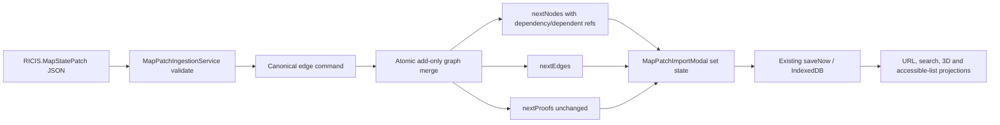

# P1 Catalog Navigation and Core Status — Шаг 2: architecture contracts

**Статус:** `DRAFT — Step 1 approved by user; this document requires explicit approval before Step 3 QA tests.`  
**Вход:** [`SPRINT_P1_CATALOG_NAVIGATION_CORE_STATUS_STEP1_BUSINESS_SPEC.md`](../02-sprints/SPRINT_P1_CATALOG_NAVIGATION_CORE_STATUS_STEP1_BUSINESS_SPEC.md).  
**In scope here:** only the add-only import contract required to materialize `core-agi-target → real-catalog-98`. The separate Core-status presentation correction remains a later P1 increment.

> **Authority boundary.** These are TypeScript data-flow contracts. They preserve RICIS identities and public evidence boundaries but neither evaluate a singularity nor define RICIS semantics. A map edge is a structural dependency reference, not a proof, a Core result, or a Lean theorem.

## 1. Causal correction and bounded ownership

The current import DTO accepts `edges`, but the patch application boundary returns only `nextNodes` and `nextProofs`; incoming edges are silently discarded. The new design gives **one bounded context** responsibility for edge validation, canonicalization, atomic add-only merge, and bidirectional node-reference projection: the existing `MapPatchIngestionService`.

No URL component, UI modal, persistence adapter, migration audit, RICIS engine, Lean evidence service, or node-card renderer acquires duplicate graph-merge logic.



| Layer | Owns | Must not own |
|---|---|---|
| `MapPatchIngestionService` | Parsing, validation, canonical directed relation identity, atomic merge result. | RICIS calculation, proof trust promotion, URL parsing, React state or IndexedDB writes. |
| `MapPatchImportModal` | User-visible validation preview and application of full merge result. | Edge inference, node reconciliation, proof classification. |
| `useMapStore` | State persistence after accepted merge. | Revalidating or rewriting imported semantic data. |
| `UrlShareService` / `Map3D` / `AccessibleMapFallback` | Projection of final graph state. | Import semantics or evidence promotion. |

## 2. Vocabulary and identity invariants

| Term | Contractual meaning | RICIS / trust status |
|---|---|---|
| `NodeId` | Existing opaque `ProblemNode.id`; exact source identity. | `STRUCTURAL_REFERENCE` |
| `DirectedEdgeKey` | Canonical ordered pair `${fromId}->${toId}`. Direction is not silently reversed. | `STRUCTURAL_REFERENCE` |
| `MapEdgePatch` | Add-only directed link between two existing or same-payload-created nodes. | `OPERATIONAL_DATA_INTEGRITY` |
| `GraphMergeResult` | Atomic tuple of nodes, edges, proofs and audit counts after all validation. | `OPERATIONAL_DIAGNOSTIC` |
| `proofs` | Existing optional separate payload. | Never inferred from an edge or node patch. |
| `real-catalog-98` | Existing canonical research node. | `unresolved`; no Lean/Core proof evidence. |

The identity invariant is exact: an accepted source ID and target ID preserve their strings and refer only to the two resolved `ProblemNode` records. A patch may **add** a relation; it may not change either endpoint’s `state`, source-locked external Lean bytes, trust status, proof text, target expression, economic attributes, or IDs unless an independently existing node-patch/proof policy permits that action. The P1 reference patch will not include any proof object.

## 3. DTO and result contract

The implementation keeps the established external envelope `@type: "RICIS.MapStatePatch"` and existing `edges` property. It adds a named DTO at the end of `mapPatchIngestion.types.ts`; it does not rename a public field or create a parallel import format.

```ts
export interface IMapEdgePatchDTO {
  readonly fromId?: string;
  readonly toId?: string;
  /** Legacy input aliases; normalized before merge and never emitted as the canonical result. */
  readonly from?: string;
  readonly to?: string;
  readonly label?: string;
}

export type MapPatchEdgeRejectionReason =
  | 'edge_endpoint_missing'
  | 'edge_endpoint_unknown'
  | 'edge_self_reference'
  | 'edge_identity_conflict'
  | 'edge_payload_invalid';

export interface IMapPatchGraphMerge {
  readonly nextNodes: ProblemNode[];
  readonly nextEdges: DependencyEdge[];
  readonly nextProofs: Record<string, Proof>;
  readonly result: IMapPatchIngestionResult;
}
```

`IMapPatchPayloadDTO.edges` becomes `IMapEdgePatchDTO[]`. The `applyPatch` signature returns `IMapPatchGraphMerge`, allowing the existing modal to persist `nodes`, `edges`, and `proofs` as one state transition. This is an additive result field: all callers must consume `nextEdges`; no default fallback is permitted because dropping an accepted relation would recreate the defect.

## 4. Validation and canonicalization contract

The service must validate the complete prospective graph **before mutating any output copy**. A node supplied through `nodePatches` participates in endpoint resolution after its proposed identity has been validated, allowing one payload to create `real-catalog-98` and add its edge.

| Input condition | Typed policy result | Mutation |
|---|---|---|
| Both `fromId` and `toId` present after accepting legacy aliases, distinct and nonempty | Canonical `DirectedEdgeKey`. | Eligible for merge. |
| One endpoint absent, blank or aliases disagree | `edge_endpoint_missing` / `edge_payload_invalid`. | Entire patch rejected; no partial node/edge/proof result. |
| Endpoint absent from current nodes and valid `nodePatches` of same payload | `edge_endpoint_unknown`. | Entire patch rejected. |
| `fromId === toId` | `edge_self_reference`. | Entire patch rejected. |
| Same directed key repeated in payload with incompatible label/shape | `edge_identity_conflict`. | Entire patch rejected. |
| Same directed key already exists in graph | Idempotent accepted no-op. | No duplicate edge or node references. |

A reverse edge is not considered the same relation. If supplied, it is a distinct directed claim and requires its own explicit JSON entry; P1 reference JSON does not add it.

## 5. Atomic add-only merge semantics

After all node, proof and edge inputs validate, the service creates output copies only. For every new `fromId → toId` relation:

1. Materialize one `DependencyEdge` with the deterministic ID `edge-${fromId}-${toId}` and existing graph defaults for a non-proven dependency relation.
2. Add `fromId` to the target node’s `dependencyIds` only if absent.
3. Add `toId` to the source node’s `dependentIds` only if absent.
4. Preserve every existing node field, proof registry entry and existing edge unchanged.
5. Increment `createdEdgeCount` only when a new directed relation is materialized.
6. Include both endpoint IDs in `affectedNodeIds` in canonical first-seen input order.

The reference result must contain exactly one graph relation:

```text
fromId = core-agi-target
toId   = real-catalog-98
edgeId = edge-core-agi-target-real-catalog-98
```

It must **not** infer mathematical dependency, solve the Pareto node, attach a proof, or classify `core-agi-target` as proved. Its only statement is that the map’s structural graph now contains an explicit directed route from the existing root reference to the unresolved catalog node.

## 6. Proof and state non-promotion boundary

| Field / outcome | P1 import rule |
|---|---|
| `state` for `real-catalog-98` | Explicitly remains `unresolved`. |
| `proofs["real-catalog-98"]` | Absent before and after reference patch. |
| `externalLean`, `LEAN_VERIFIED`, `TRUSTED_AXIOM`, `QED_VERIFIED` | Must not be created, copied or inferred. |
| `targetFunction`, description, valuation | May be supplied only in the source-defined node patch; no values are calculated from the edge. |
| Existing source-locked Lean payload | Existing object/bytes remain unmodified. |
| Core runtime | Not called and not consulted by import. |
| RICIS `0/0`, L1, SP rules | Not evaluated or rewritten by import. |

## 7. UI/store integration seam

The existing modal already owns the user-initiated apply action. It will receive the complete merge tuple and perform one existing Zustand state update:

```ts
useMapStore.setState({
  nodes: merged.nextNodes,
  edges: merged.nextEdges,
  proofs: merged.nextProofs,
});
void map.saveNow();
```

The modal’s completion display must use the factual `createdEdgeCount` so the user can distinguish “node patch accepted” from “node and relation materialized.” It must not report a proof count unless `proofsAttachedCount > 0`; for the P1 reference patch it is exactly zero.

No UI component needs an import-specific search workaround. Once the node is present in map state, the separate later P1 navigation slice can make query-by-ID explicit. This import slice guarantees the source graph contains the selected node and relation; it does not prematurely implement deep-link presentation logic.

## 8. Step 3 QA contract

| Test ID | Given | Expected result |
|---|---|---|
| EDGE-QA-01 | Fresh map plus reference P1 patch. | One new node, one new edge, `core-agi-target.dependentIds` includes `real-catalog-98`, target `dependencyIds` includes root, no proofs. |
| EDGE-QA-02 | Same patch twice. | Second application creates zero nodes/edges and does not duplicate relation arrays. |
| EDGE-QA-03 | Persisted current-version map missing node. | Merge adds node/edge without clearing unrelated nodes, proofs or zones. |
| EDGE-QA-04 | Missing, blank, conflicting alias or unknown edge endpoint. | `success: false`; state output is exact original state. |
| EDGE-QA-05 | Self-edge. | Typed rejection and unchanged output. |
| EDGE-QA-06 | Existing external Lean source-locked proof unrelated to patch. | Exact unchanged proof object and zero proof attachments. |
| EDGE-QA-07 | Reference patch. | `real-catalog-98.state === 'unresolved'`; no evidence/trust label exists or changes. |
| EDGE-QA-08 | Existing node-only and full-map import regression samples. | Existing accepted behaviour remains compatible. |

## 9. Architecture acceptance checklist

1. One service owns edge canonicalization and merge; no UI/persistence duplication.
2. Validation is atomic and occurs before any output state mutation.
3. Add-only directed edge identity is exact, deterministic and idempotent.
4. Edge and reciprocal node arrays remain structurally consistent.
5. `nextEdges` crosses the service-to-modal state boundary in one transaction.
6. No edge can alter `state`, proof, Lean evidence, RICIS result or Core status.
7. The reference JSON’s success evidence is `createdNodeCount: 1`, `createdEdgeCount: 1`, `proofsAttachedCount: 0` on a state missing the node.
8. All listed red/green and preservation tests are written before implementation.

## 10. Approval boundary

Approval of this document authorizes **only Step 3: executable QA tests** for this architecture. It does not authorize production implementation, version change, data import, Core endpoint configuration, commit, push, PR, deployment, proof submission, trust promotion, or state resolution.

**Requested confirmation:** reply **`OK`** to proceed to Step 3 QA tests.
