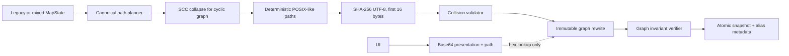

# SHA-128 Node Identity Migration — Step 2: Architecture

**Status:** `DRAFT — architecture-only; implementation follows red baseline.`

**Scope identifier:** `P1-SHA128-NODE-IDENTITY-MIGRATION-01`.

**Input:** [Step 1 business specification](../02-sprints/SPRINT_SHA128_NODE_IDENTITY_MIGRATION_STEP1_BUSINESS_SPEC.md).

## 1. Architectural decision

The migration is implemented as a pure planning and immutable rewrite pipeline. It first reads a legacy `MapState`, constructs a deterministic canonical-path plan from the original graph, computes one complete legacy-to-SHA-128 mapping table, validates collisions and all references, then returns a new graph projection. No object is mutated before the plan is valid.

The digest port produces SHA-256 over UTF-8 canonical-path bytes and truncates the digest to 16 bytes. The internal ID formatter emits 32 lowercase hexadecimal characters. A separate presentation helper encodes those same 16 bytes as standard Base64. The Base64 value is never passed into domain lookup or reference fields.



## 2. Modules and dependency direction

| Module | Responsibility | Must not depend on |
|---|---|---|
| `nodeIdentityPath.ts` | Unicode normalization, segment sanitization, POSIX path joining and deterministic ancestry/SCC path planning | UI, IndexedDB, React, mutable global state |
| `nodeIdentityDigest.ts` | SHA-256 truncation, lowercase hex formatter, Base64 formatter and digest validation | Map store, UI, provider code, RICIS/Lean authority |
| `nodeIdentityMigration.ts` | Expand/plan/rewrite/verify migration orchestration and alias table creation | React, browser globals except injected persistence ports, proof synthesis |
| `nodeIdentityMigrationPersistence.ts` | Versioned metadata and atomic persistence adapter | Hash algorithm decisions, UI, provider code |
| `nodeIdentityPresentation.ts` | Hex-to-Base64 display and canonical path DTO | Map mutation, persistence writes, digest recomputation from display text |
| `persistence.ts` integration | Run migration at hydrate/import/export boundaries and preserve legacy alias resolution | Direct path algorithm duplication |
| UI components | Render Base64 key and path, use hex/alias resolver for navigation | Base64-as-domain-ID, legacy ID as primary display |

The path planner and digest service are pure or injected ports. The migration service owns all reference rewriting. No caller may manually rewrite one field independently.

## 3. Canonical path planner

The planner receives nodes and dependency edges using legacy IDs. It creates a directed dependency graph where each node points to its dependency parents. It computes strongly connected components using a deterministic Tarjan/Kosaraju implementation, sorts members by normalized segment then legacy ID, and builds a component DAG. Root components are those without dependency parents.

For each component, candidate paths are generated from all reachable root component paths. Root seed ordering is lexical by normalized root segment and legacy ID. A node with multiple parents chooses the lexicographically smallest complete candidate path. A cyclic component contributes a stable segment of the form `cycle-<member-segment>-<member-segment>`, and each member receives that component path plus its own normalized segment. If no root is reachable because of malformed data, the planner returns a typed `orphan_component` error instead of inventing a root.

The planner stores both `canonicalPath` and `pathSource` metadata. The path is absolute, uses `/`, contains no empty/dot/dot-dot segments, and is normalized before digesting. Two distinct nodes may not receive the same path. A duplicate path is a hard collision even if legacy IDs differ.

## 4. Digest and presentation ports

```ts
export interface NodeIdentityDigestPort {
  digest128Hex(canonicalPath: string): Promise<string>;
  base64FromHex(id: string): string;
  isSha128Hex(id: string): boolean;
}

export interface NodeIdentityPathPlan {
  readonly legacyId: string;
  readonly canonicalPath: string;
  readonly sha128Hex: string;
}
```

`digest128Hex` is the only operation allowed to create a migrated node ID. It must use UTF-8 bytes, SHA-256, the first 16 digest bytes and lowercase hex. `base64FromHex` decodes exactly 16 bytes and returns standard Base64 with padding. Invalid lengths, non-hex characters and non-16-byte values are rejected; no lossy conversion is allowed.

The browser implementation may use the platform Web Crypto API through an injected asynchronous port. The migration entry point is already asynchronous through IndexedDB hydration/import, so digesting remains deterministic without adding Node-only imports to the client bundle. A future synchronous node-creation path must use the same port or await the identity service; it must never reintroduce ad hoc IDs.

## 5. Immutable graph rewrite

The rewrite is a two-pass operation. Pass one creates a `legacyId -> newHexId` map and a `newHexId -> canonicalPath` map after all collision checks pass. Pass two maps every reference field listed in Step 1 and copies all non-reference fields unchanged.

| Projection | Rewrite action |
|---|---|
| Node | Copy node, set `id` to new hex and add `canonicalPath`; preserve title, description, state, type, target function, economics and proof-related metadata |
| Dependency/dependent arrays | Map through the complete table, preserve source order, remove only duplicate IDs introduced by repeated legacy references |
| Edge | Preserve edge ID and attributes; map `fromId` and `toId` |
| Zone | Preserve zone ID/profile; map `nodeIds` |
| Axiom | Preserve axiom ID/statement; map source and usage references |
| Proof | Re-key record, map `nodeId`, preserve the proof object and all Lean provenance fields byte-for-byte |
| Agent log | Preserve log identity/timestamp/message; map optional `nodeId` |

The rewrite rejects any missing mapping, duplicate new ID, dangling endpoint, proof-key mismatch or unresolvable alias before it can be persisted. It returns a report containing counts and a hash of the mapping table, but never exposes legacy source content as a UI primary identifier.

## 6. Persistence and migration versioning

The current migration version is incremented once for the SHA-128 migration. The persisted metadata contains the migration version, algorithm tag `sha256-truncated-128`, canonicalization revision, mapping-table hash and a bounded legacy alias table. The alias table maps legacy IDs to new hex IDs and is read-only after commit.

The migration uses a transactional adapter abstraction. In IndexedDB, the rewritten map and migration metadata are written in one transaction or neither is committed. If the host cannot provide atomic persistence, the service returns a typed migration failure and leaves the old snapshot intact. Import follows the same plan/validate/rewrite flow before replacing the stored map.

Hydration uses expand/dual-read/rewrite/verify/cleanup: legacy snapshots are read, migrated in memory, verified, written atomically and served with aliases. New exports contain SHA-128 IDs and canonical paths. Old deep links and old patch references resolve through aliases during the compatibility window. Base64 is never accepted as a legacy alias.

## 7. Compatibility and graph invariants

The verifier compares the pre- and post-migration graph using the legacy mapping. It asserts equal node, edge, zone, axiom and proof counts; equal relationship multiset after endpoint remapping; valid reciprocal dependency/dependent references; valid edge endpoints; valid zone members; valid axiom/proof/log references; stable non-reference fields; unique paths; unique IDs; and idempotence on a second run.

The verifier also checks that no node state, node type, target function, formula, proof trust status, external Lean evidence, axiom statement or RICIS semantic field changes. Identity migration is not proof processing and cannot promote or demote any authority status.

## 8. UI and navigation boundary

The UI receives a presentation DTO containing `base64Key`, `canonicalPath` and the internal `hexId` only where a lookup/navigation action explicitly requires it. Cards and details render `base64Key` as the compact key and render `canonicalPath` on a separate filesystem-like line. Search/deep-link/import resolution uses the internal hex ID or a legacy alias resolver.

The path shown to users is not recomputed from a translated Base64 value. It comes from persisted `canonicalPath`, preventing presentation changes from silently changing identity. Editing a title does not automatically regenerate an existing ID; a future path-change migration must be explicit.

## 9. Failure modes

| Failure | Result |
|---|---|
| Duplicate legacy ID | Abort before path/digest rewrite |
| Duplicate canonical path | Abort with collision report |
| Duplicate SHA-128 digest | Abort with both paths and legacy IDs, before persistence |
| Missing reference | Abort; never invent an ID |
| Unresolved cycle/orphan component | Abort with typed planner error |
| Malformed mixed snapshot | Preserve old snapshot and return import/migration failure |
| Non-atomic persistence | Do not replace existing snapshot |
| Invalid Base64 display value | Presentation error; domain graph remains unchanged |

## 10. Security and RICIS boundary

A SHA-128 ID is a compact content-derived identifier, not a security credential, access token, proof or authority marker. The shortened digest must not be described as collision-proof or cryptographic authentication. Collision detection over the complete graph is mandatory.

The migration changes only identifiers, paths and reference representations. It must not inspect, synthesize, repair or reinterpret proofs. RICIS rules, including typed identity and `X/X = 1`, remain normative but are not evaluated by this migration.

## 11. Architecture acceptance criteria

Step 2 is complete when Step 3 can target pure normalization/digest vectors, deterministic multi-root/multi-parent/SCC paths, complete reference rewrite, alias resolution, collision abort, idempotence, atomic persistence behavior, Base64 presentation and proof/state immutability without requiring the browser or network.

## References

[1]: `docs/02-sprints/SPRINT_SHA128_NODE_IDENTITY_MIGRATION_STEP1_BUSINESS_SPEC.md` — approved migration business rules.

[2]: `src/model/types.ts` — current graph reference fields.

[3]: `src/model/migrationAudit.ts` — existing one-time migration pattern.

[4]: `src/model/persistence.ts` — existing hydration/import/export boundaries.
