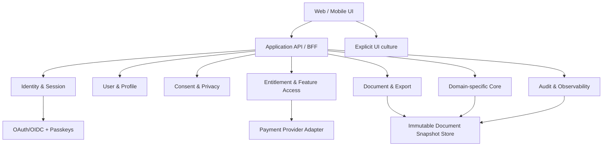

# Canonical Application Blueprint — шаблон приложения с нуля

**Статус:** reusable reference architecture; не является готовым кодом, коммерческим предложением, платёжной интеграцией или security certification.
**Цель:** дать минимальный полный каркас для нового web application, в котором features, documents, identities, consent, entitlements and exports построены без смешения обязанностей и без неявного доверия.

> Каждый модуль реализуется только через `G1 analysis → G2 contracts → G3 tests → G4 implementation` и отдельное пользовательское approval после первых трёх gates. См. [Strict Development Rules](./STRICT_DEVELOPMENT_RULES.md).[1]

## 1. Product core and bounded contexts



| Bounded context | Aggregate / core objects | Owns | Never owns |
|---|---|---|---|
| **Identity & Session** | `Account`, `ExternalIdentity`, `Session`, `PasskeyCredential`. | Authentication, account linking, session lifecycle, recovery policy. | Profile truth, payment truth, document content, proof truth. |
| **User & Profile** | `UserProfile`, `ProfileField`, `ProfileSource`. | User-editable display data and explicit preferences. | OAuth token, identity merge by email, academic claim without review. |
| **Consent & Privacy** | `ConsentGrant`, `DataUsePurpose`, `RetentionPolicy`. | Field-level permission, revocation, deletion request, disclosure record. | Global silent consent or irreversible prefill. |
| **Entitlement & Monetization** | `Product`, `PriceReference`, `Subscription`, `Entitlement`, `UsageGrant`. | Capability authorization, quotas, invoices/reference IDs, webhook idempotency. | UI-only payment success, raw card data, provider secret. |
| **Document & Export** | `DocumentDraft`, `DocumentSnapshot`, `ExportJob`, `ExportArtifact`. | User-reviewed draft, immutable rendering input, export format/status. | Recomputing domain proof, changing trust status in renderer. |
| **Domain Core** | Domain aggregates and typed results. | Actual application logic, validation, evidence/trust state. | Authentication transport, pricing and arbitrary provider profile reads. |
| **Notification** | `NotificationPreference`, `DeliveryAttempt`. | User-approved messages and delivery state. | Authentication, entitlement or proof promotion. |
| **Audit & Observability** | `AuditEvent`, `SecurityEvent`, `Metric`. | Redacted event evidence and operational health. | Raw secrets, full tokens, biometric data, user document body by default. |

## 2. Layering and package map

```text
apps/<application-web>          UI and composition root only
packages/<domain>-core          Value objects, policies, aggregates, ports, use cases
packages/<domain>-node          Server-only adapters and secret-bearing integrations
packages/ricis-auth-core        Generic identity/consent/passkey contracts
packages/ricis-auth-node        Generic OIDC/WebAuthn/session/vault adapters
packages/document-core          Immutable document model, renderer ports, export policies
packages/billing-core           Product/entitlement policy and payment provider ports
packages/shared-contracts       Versioned API DTOs, error/status vocabulary
```

The dependency direction is strict: UI and transport depend on application use cases; use cases depend on domain objects and ports; adapters implement ports; composition root binds dependencies. No domain package imports React, Express, browser storage, SQL, payment SDK, OAuth SDK, environment variable or singleton.[1]

| Interface family | Required port examples | Why it exists |
|---|---|---|
| Time and identifiers | `IClock`, `IIdentifierFactory`, `IIdempotencyKeyFactory`. | Deterministic tests and non-guessable lifecycle records. |
| Identity | `IIdentityRepository`, `ISessionRepository`, `IOidcConnector`, `IPasskeyConnector`. | Separates provider protocol from local principal. |
| Consent | `IConsentRepository`, `IProfileFieldReader`, `IRetentionScheduler`. | Makes provider reads impossible without explicit purpose-bound grant. |
| Entitlement | `IProductCatalog`, `IPaymentGateway`, `IEntitlementRepository`, `IWebhookVerifier`. | Treats payment provider as adapter, not business truth. |
| Documents | `IDocumentRepository`, `IRenderer`, `IExportStorage`, `IArtifactSigner`. | Keeps rendering/export reproducible from a frozen snapshot. |
| Domain | `IDomainEngine`, `IProofEvidenceStore` where relevant. | Prevents a second computation engine in UI or renderer. |
| Operations | `IAuditSink`, `IMetricsSink`, `INotificationGateway`. | Makes side effects redacted, observable and replaceable. |

## 3. Identity, users and explicit consent

### 3.1 Authentication capability taxonomy

| Capability | Canonical implementation | Security boundary | P0 outcome |
|---|---|---|---|
| Google / Telegram / ORCID sign-in | Generic OIDC authorization-code flow, PKCE S256, state, nonce, verified ID token and provider subject. | Server-only client secret/code exchange; local `AccountId` is primary key. | Login and explicit identity linking. |
| Face ID-capable login | WebAuthn passkey with `userVerification: required`. | Device retains biometric factor/private key; server retains public credential material only. | Passwordless sign-in / optional step-up. |
| Manus connection | Separate delegated service OAuth capability. | Not a general identity claim; minimal approved scopes only. | Future explicit API connection. |
| Zenodo connection | Separate publication/deposit service capability after discovery/registration gate. | Not a sign-in provider; no PAT collection in UI. | Future explicit artifact workflow. |
| Anonymous session | Ephemeral, limited local session. | No personalization, payment, protected export or provider linking. | Explore public application safely. |

Account linking is never performed only because email, display name, provider locale or profile text matches. An existing authenticated local session and explicit link command are required.

### 3.2 Consent workflow

```text
authenticate → optional link provider → show field/purpose disclosure
→ user explicitly grants → server reads approved fields only → review-required draft
→ user confirms/edits → document snapshot
```

| Rule | Required behavior |
|---|---|
| Separate action | OAuth sign-in never implies report prefill, publishing, billing or notification consent. |
| Minimum fields | Start with only `display_name` and authenticated `orcid_id` where the provider actually supplies them. |
| Field scope | Grant includes provider, field names, purpose, policy version, timestamps and expiry. |
| Review | Each prefilled field is source-labelled and editable; no automatic authorship/SEO/proof/publication effect. |
| Revocation | Stops future provider reads immediately; existing user-confirmed document snapshot is handled by stated retention policy. |
| Culture | Explicit UI culture wins; client country fallback is separate and no provider claim silently selects document language. |

## 4. Monetization and entitlement model

Pricing, taxes, payment methods, currency, refunds and available regions are external product-policy inputs, not constants in domain code. The template defines a capability system that can support free and paid offerings without conflating payment UI with authorization.

| Object | Minimum fields | Invariant |
|---|---|---|
| `Product` | `productId`, `productVersion`, `featureSet`, `active`. | Does not contain private payment-provider secret. |
| `PriceReference` | `productId`, `providerPriceReference`, `currency`, `regionPolicyVersion`. | Displayed price is fetched/validated from approved server catalog. |
| `CheckoutIntent` | `accountId`, `productId`, `idempotencyKey`, `createdAt`, `status`. | Client cannot mark it paid. |
| `PaymentEvent` | `providerEventId`, verified signature, event type, received time. | Provider event is processed once idempotently. |
| `Entitlement` | `accountId`, `feature`, `source`, `startsAt`, `endsAt`, `status`. | Only verified server-side event or explicit admin policy grants it. |
| `UsageGrant` | `accountId`, `feature`, quota window, consumed units. | Checked server-side before metered operation starts. |

A payment provider adapter exposes `createCheckout`, `verifyWebhook`, `requestCustomerPortal` and `refundOrCancel` only after business/legal approval. UI receives an opaque checkout redirect/session and entitlement summary, not processor secret or raw financial metadata.

## 5. Feature tiers / сетки доступа

The names and prices are product decisions. The following is a feature matrix template; all enforcement must occur in server application use cases and not only by hiding UI controls.

| Feature / capability | Anonymous | Registered | Verified identity | Research / collaborator | Paid entitlement | Operator |
|---|---:|---:|---:|---:|---:|---:|
| View public map/content | Yes | Yes | Yes | Yes | Yes | Yes |
| Local draft and limited export | Limited | Yes | Yes | Yes | Configured quota | Yes |
| Save private drafts | No | Yes | Yes | Yes | Yes | Support only |
| OAuth/passkey settings | No | Yes | Yes | Yes | Yes | Support only |
| Consent-based author prefill | No | No | Approved provider only | Approved provider only | Approved provider only | No implicit read |
| Advanced report/export formats | No | Configured | Configured | Yes | Entitlement-controlled | Yes |
| Manus/Zenodo service connections | No | No | Subject to separate approval | Subject to policy | Entitlement/policy | Controlled support |
| AI/Core intensive execution | Public safe limit | Configured quota | Configured quota | Project quota | Paid/metered quota | Operational tools |
| Team/shared workspace | No | No | Invitation only | Entitlement and role | Entitlement and role | Yes |
| Billing portal and invoices | No | If customer exists | If customer exists | If customer exists | Yes | Support only |
| Policy/incident operations | No | No | No | No | No | Role-gated |

Feature decision API returns an explainable typed result:

```ts
type FeatureDecision =
  | { kind: 'allowed'; entitlementId?: string; remainingQuota?: number }
  | { kind: 'requires_authentication' }
  | { kind: 'requires_consent'; purpose: string }
  | { kind: 'requires_entitlement'; feature: string }
  | { kind: 'quota_exhausted'; retryAt: string }
  | { kind: 'policy_unavailable'; reason: 'region' | 'provider' | 'maintenance' };
```

## 6. Documents, reports and exports

| Stage | Input | Output | Invariant |
|---|---|---|---|
| Draft | User values plus approved prefill fields. | Mutable `DocumentDraft`. | Human review remains required. |
| Validate | Typed domain/document schema. | Typed validation issues or accepted draft. | Reject unknown/unsafe payloads; do not execute user templates/code. |
| Freeze | Accepted draft + referenced domain snapshot + explicit culture. | Immutable `DocumentSnapshot` with hash/version. | Export never reads mutable live state. |
| Render | Frozen snapshot plus external localized template/resources. | Format-specific source/bytes. | Renderer cannot recompute domain proof or alter trust status. |
| Export | Renderer artifact plus access decision. | Signed/stored artifact metadata and bounded download URL. | Entitlement checked before job; result audited without document body. |

Supported exports are feature flags, for example `json`, `latex`, `pdf`, `lean-source`, `academic-report`. Each uses the same frozen snapshot, source labels, culture, template version and verification/trust labels. Generic Lean export must reject unsupported shape rather than emit a comment scaffold as a proof.[2]

## 7. Data, privacy, audit and operations

| Data class | Storage rule | User/operation rule |
|---|---|---|
| Session / OAuth state / PKCE / challenge | Short-lived server record, one-time consumption, protected storage. | Opaque cookie only; no browser bearer token. |
| Provider token | Encrypted server vault reference. | Accessible only to approved capability adapter; delete/revoke on disconnect. |
| Passkey | Public key, credential identifier, counter and lifecycle metadata. | No biometric/private key ever enters app. |
| Profile / consent | Minimal field values and consent scope/purpose/version. | View/revoke/delete through settings according to policy. |
| Document snapshot | Immutable, versioned, access-controlled artifact. | User can export/delete according to retention and legal policy. |
| Payment/entitlement | Provider reference and verified event/entitlement state. | No raw card data; support actions audited. |
| Audit event | Redacted structured event with actor/result/resource class. | Never raw secret, token, document body or biometric data. |

Every external operation has timeout, idempotency where needed, retry classification, redacted error message, correlation ID and audit outcome. A static-only deployment must return `server_capability_unavailable` for OAuth, passkeys verification, payment, token vault or protected export instead of emulating security server-side behavior in `localStorage`.

## 8. API and UI boundary

| Endpoint family | Example | Contract requirement |
|---|---|---|
| Identity | `/api/auth/{provider}/start`, `/callback`, `/session`, `/passkeys/*`. | State/PKCE/nonce/challenge server-side; cookies secure; no raw claims. |
| Consent | `/api/consents/document-prefill`. | Explicit purpose/fields/policy version; revoke endpoint. |
| Entitlement | `/api/features/{feature}`, `/api/checkout`, `/api/webhooks/payment`. | Server-side decision, signed webhook, idempotency. |
| Documents | `/api/documents/drafts`, `/snapshots`, `/exports`. | Bounded schema, explicit culture, access decision, frozen snapshot. |
| Domain | `/api/<domain>/v1/*`. | Typed errors, authority boundary, no arbitrary code execution. |
| Operations | `/api/health`, support-safe audit query. | Redacted, role-gated, no secret telemetry. |

React/Zustand or other UI state stores only DTOs that are safe for the browser. They never contain a provider client secret, access token, refresh token, passkey key, payment secret, full sensitive claim or authoritative entitlement mutation.

## 9. Delivery sequence

1. Define current business objective, audience, data classes, threat model, feature grid and acceptance criteria.
2. Create strict TypeScript domain packages, value objects, API schema and ports; approve contracts.
3. Write negative/replay/permission/retention/quota/export tests; approve QA plan.
4. Implement one bounded context at a time: identity/session → consent/profile → documents → entitlement/payment → domain integrations.
5. Integrate UI only through typed API DTOs; add explicit culture, loading/error/recovery states and accessibility fallback.
6. Run clean install, audit, lint, full unit/integration tests, build, secret scan, link/schema validation and deployment smoke test.
7. Record version, commit, actual results, restrictions and outstanding external prerequisites.

## 10. Definition of done

| Area | Required evidence |
|---|---|
| Architecture | Approved contracts, explicit dependency direction, no provider/secret/domain leakage. |
| Security | Secret redaction tests, OAuth replay tests, passkey origin/RP/UV tests, consent bypass/revocation tests, webhook signature/idempotency tests. |
| Billing | No entitlement from UI alone; verified event → idempotent entitlement → auditable feature decision. |
| Documents | One immutable snapshot drives every export; source/trust/culture visible and reproducible. |
| Quality | Direct public-method tests, regression suite, strict types, build, release metadata and residual-risk record. |
| Operations | Health/readiness, structured redacted logs, correlation IDs, backup/retention/deletion policy and incident path. |

## References

[1]: [Strict Development Rules](./STRICT_DEVELOPMENT_RULES.md) — lifecycle, security, evidence and quality gates.
[2]: [`MD review requirements`](../00-governance/MD_REVIEW_REQUIREMENTS_2026-08-20.md) — canonical derivation/export and Core/Lean trust boundary.
[3]: [`Ricis.Auth architecture`](../01-architecture/SPRINT_AUTH_LIBRARY_STEP2_ARCHITECTURE.md) — identity, passkey, consent, token-vault and locale separation.
[4]: [`DDD refactor plan`](../01-architecture/DDD_REFACTOR_PLAN.md) — clean dependency direction, SOLID/DRY and port/adapter rules.
